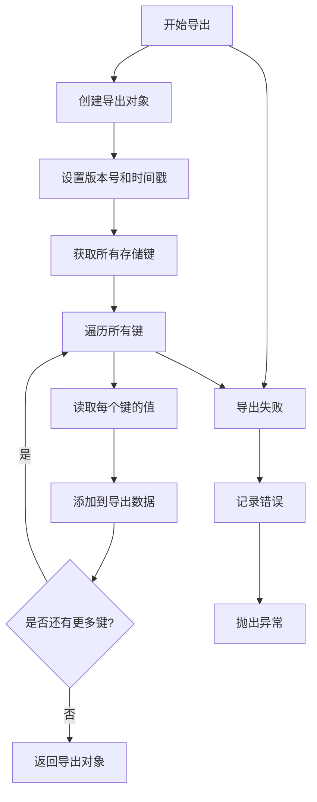
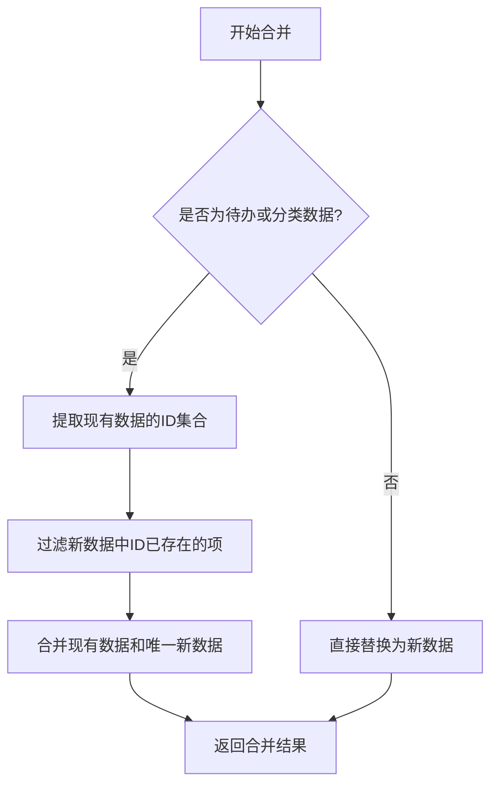
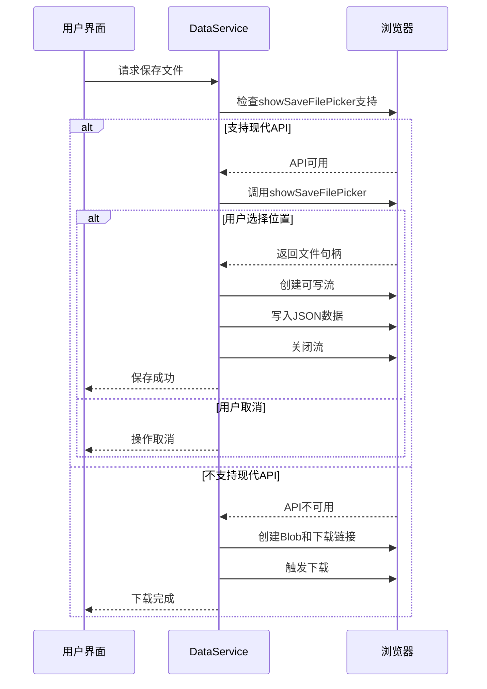
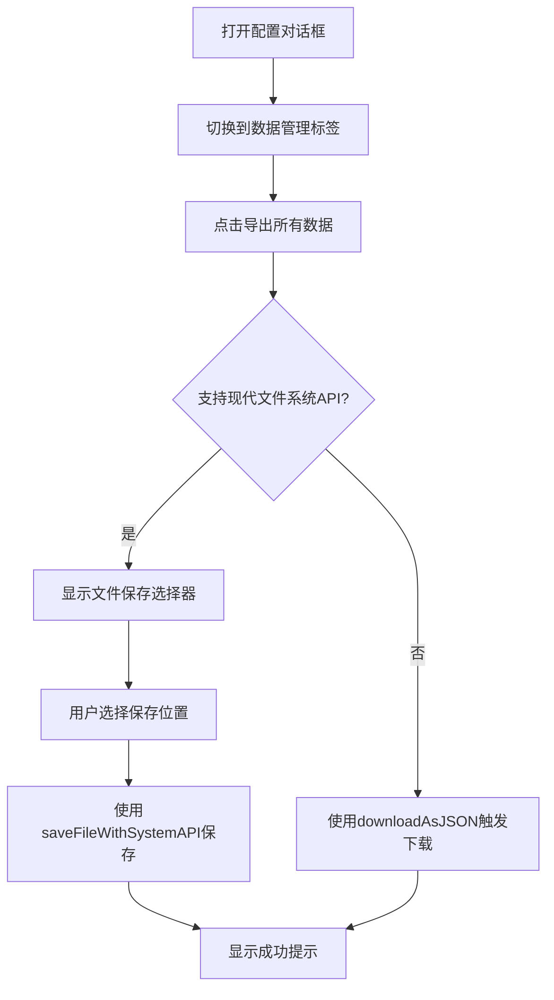
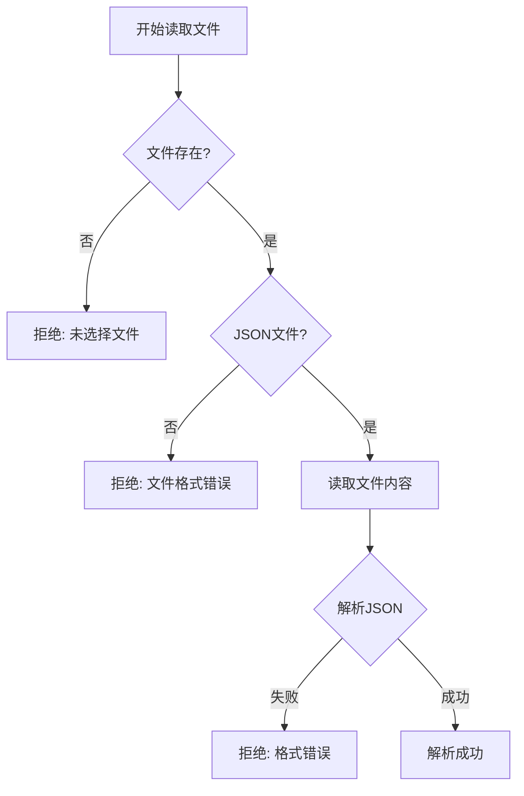

# 数据导入导出

<cite>
**Referenced Files in This Document**  
- [dataService.js](file://src/services/dataService.js)
- [ConfigDialog.vue](file://src/model/ConfigDialog.vue)
- [todoService.js](file://src/services/todoService.js)
</cite>

## 目录
1. [数据导入导出](#数据导入导出)
2. [核心功能概述](#核心功能概述)
3. [数据导出机制](#数据导出机制)
4. [数据导入与合并策略](#数据导入与合并策略)
5. [文件系统API与降级处理](#文件系统api与降级处理)
6. [用户界面工作流程](#用户界面工作流程)
7. [错误处理与验证](#错误处理与验证)

## 核心功能概述

`DataService` 类提供了完整的数据备份与恢复功能，支持数据的导出和导入操作。该服务通过 `exportAllData` 和 `importData` 静态方法实现核心功能，确保用户数据的安全性和可移植性。数据导出采用版本化结构设计，包含版本号、时间戳和实际数据三个核心字段，便于后续的数据兼容性管理和追溯。

**Section sources**
- [dataService.js](file://src/services/dataService.js#L13-L35)
- [dataService.js](file://src/services/dataService.js#L46-L86)

## 数据导出机制

`DataService.exportAllData` 方法负责将应用中的所有数据打包导出。该方法首先创建一个包含版本信息和时间戳的导出对象，然后通过 `idb-keyval` 库获取所有存储的键值对，将它们整合到导出对象的 `data` 字段中。



**Diagram sources**
- [dataService.js](file://src/services/dataService.js#L13-L35)

**Section sources**
- [dataService.js](file://src/services/dataService.js#L13-L35)

## 数据导入与合并策略

`DataService.importData` 方法实现了灵活的数据导入功能，支持两种操作模式：清除现有数据（覆盖模式）和合并数据（保留模式）。在合并模式下，系统会智能地处理数组类型的数据，避免重复项的产生。

### 智能合并算法

对于待办事项和分类数据，系统采用基于ID的去重合并策略。该策略通过 `DataService.mergeArrayData` 方法实现，具体流程如下：



**Diagram sources**
- [dataService.js](file://src/services/dataService.js#L89-L99)

**Section sources**
- [dataService.js](file://src/services/dataService.js#L46-L86)
- [dataService.js](file://src/services/dataService.js#L89-L99)

#### 选项行为差异

| 选项 | 行为 | 应用场景 |
|------|------|----------|
| `clearExisting: true` | 清除所有现有数据后导入 | 数据恢复、系统重置 |
| `mergeData: true` | 智能合并数据，保留现有项 | 数据迁移、多设备同步 |

## 文件系统API与降级处理

`DataService` 实现了现代 File System Access API 与传统 Blob 下载方式的无缝集成，确保在不同浏览器环境下的兼容性。

### 降级处理逻辑



**Diagram sources**
- [dataService.js](file://src/services/dataService.js#L130-L173)
- [dataService.js](file://src/services/dataService.js#L102-L121)

**Section sources**
- [dataService.js](file://src/services/dataService.js#L102-L173)

## 用户界面工作流程

`ConfigDialog` 组件提供了用户友好的数据管理界面，允许用户通过可视化操作完成数据备份和恢复。

### 数据备份流程



### 数据恢复流程

```mermaid
flowchart TD
A[选择JSON文件] --> B{文件格式验证}
B --> |无效| C[显示错误提示]
B --> |有效| D[读取文件内容]
D --> E{解析JSON}
E --> |失败| F[显示格式错误]
E --> |成功| G[选择导入模式]
G --> H{合并或覆盖?}
H --> |合并| I[调用importData(mergeData=true)]
H --> |覆盖| J[确认操作]
J --> K[调用importData(clearExisting=true)]
I --> L[更新应用数据]
K --> L
L --> M[显示结果提示]
```

**Diagram sources**
- [ConfigDialog.vue](file://src/model/ConfigDialog.vue#L400-L450)
- [ConfigDialog.vue](file://src/model/ConfigDialog.vue#L452-L550)

**Section sources**
- [ConfigDialog.vue](file://src/model/ConfigDialog.vue#L400-L550)

## 错误处理与验证

系统实现了多层次的错误处理和数据验证机制，确保数据操作的可靠性和用户体验。

### 文件读取验证

`DataService.readJSONFile` 方法在读取文件时执行严格的验证：

1. **文件存在性检查**：确保用户已选择文件
2. **文件格式验证**：检查文件扩展名是否为 `.json`
3. **JSON语法解析**：验证文件内容是否为有效的JSON格式
4. **数据结构验证**：确保导入的数据包含必要的 `data` 字段



**Diagram sources**
- [dataService.js](file://src/services/dataService.js#L207-L236)

**Section sources**
- [dataService.js](file://src/services/dataService.js#L207-L236)