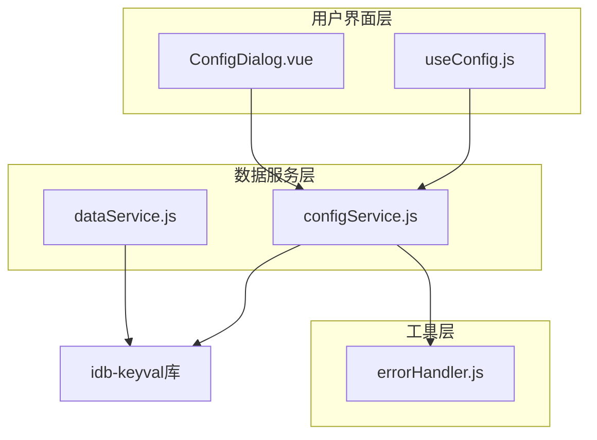
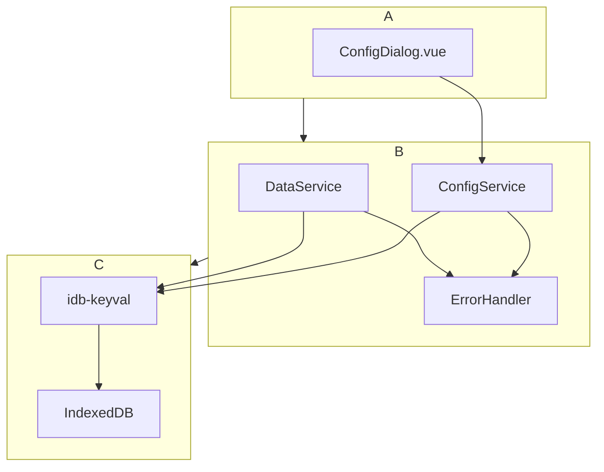
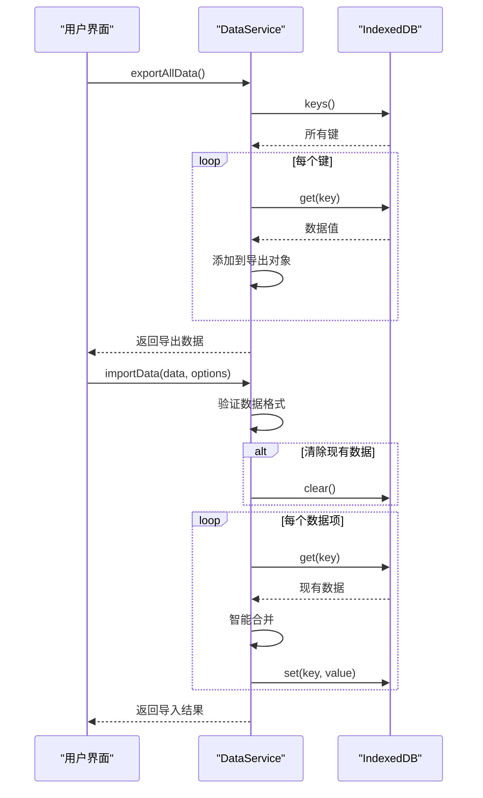
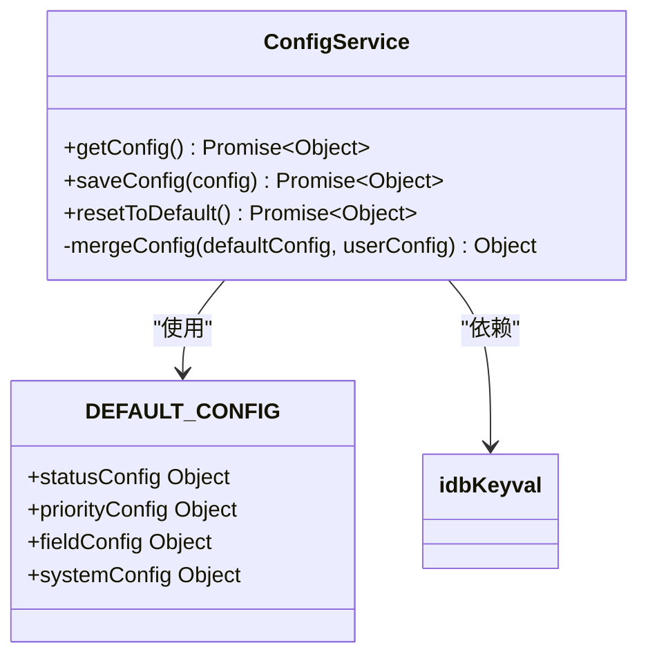
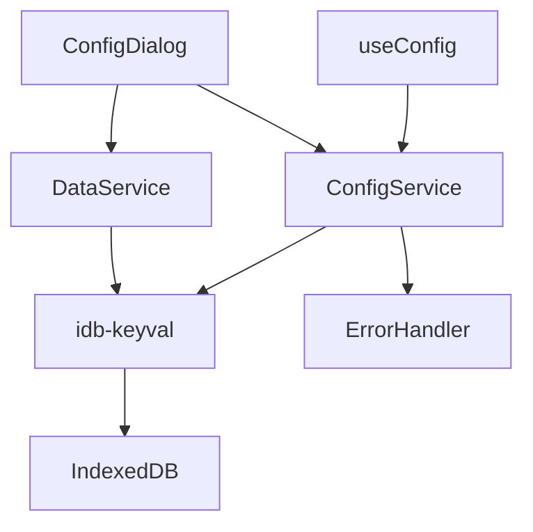

# 数据持久化

<cite>
**Referenced Files in This Document**   
- [dataService.js](file://src/services/dataService.js)
- [configService.js](file://src/services/configService.js)
- [errorHandler.js](file://src/utils/errorHandler.js)
- [ConfigDialog.vue](file://src/model/ConfigDialog.vue)
- [useConfig.js](file://src/composables/useConfig.js)
- [package.json](file://package.json)
</cite>

## 目录
1. [简介](#简介)
2. [项目结构](#项目结构)
3. [核心组件](#核心组件)
4. [架构概述](#架构概述)
5. [详细组件分析](#详细组件分析)
6. [依赖分析](#依赖分析)
7. [性能考虑](#性能考虑)
8. [故障排除指南](#故障排除指南)
9. [结论](#结论)

## 简介

本项目采用基于IndexedDB的本地数据持久化方案，通过`idb-keyval`库实现高效的数据存储与管理。系统设计了`DataService`和`configService`两个核心服务，分别负责应用数据的完整备份恢复和配置信息的持久化管理。`DataService`提供了`exportAllData`和`importData`方法，支持带版本控制和时间戳记录的数据导出导入功能，并实现了现代浏览器文件系统API与传统下载方式的兼容性处理。`configService`则专门管理应用的状态、优先级、字段显示和系统设置等配置项，确保用户自定义设置能够可靠保存和恢复。

**Section sources**
- [dataService.js](file://src/services/dataService.js#L1-L273)
- [configService.js](file://src/services/configService.js#L1-L205)

## 项目结构

项目采用模块化架构，数据持久化相关的核心服务位于`src/services`目录下。`dataService.js`和`configService.js`是两个主要的数据管理服务，分别处理应用数据和配置数据的持久化。`utils`目录下的`errorHandler.js`提供了统一的错误处理机制，确保数据操作的健壮性。配置管理的用户界面由`src/model/ConfigDialog.vue`实现，通过`useConfig.js`组合式函数与后端服务进行交互。整个数据持久化体系依赖于`idb-keyval`库，该依赖在`package.json`中明确声明。

**Diagram sources **
- [dataService.js](file://src/services/dataService.js#L1-L273)
- [configService.js](file://src/services/configService.js#L1-L205)
- [errorHandler.js](file://src/utils/errorHandler.js#L1-L109)
- [ConfigDialog.vue](file://src/model/ConfigDialog.vue#L1-L701)
- [useConfig.js](file://src/composables/useConfig.js#L1-L204)

**Section sources**
- [dataService.js](file://src/services/dataService.js#L1-L273)
- [configService.js](file://src/services/configService.js#L1-L205)
- [errorHandler.js](file://src/utils/errorHandler.js#L1-L109)
- [ConfigDialog.vue](file://src/model/ConfigDialog.vue#L1-L701)
- [useConfig.js](file://src/composables/useConfig.js#L1-L204)
- [package.json](file://package.json#L1-L38)

## 核心组件

`DataService`和`configService`是数据持久化机制的两个核心组件。`DataService`提供`exportAllData`和`importData`方法，实现完整的数据备份与恢复功能，支持版本控制、时间戳记录和智能数据合并。`configService`则专注于应用配置的管理，通过`saveConfig`和`getConfig`方法确保状态、优先级、字段显示和系统设置等配置项的持久化存储。两个服务都基于`idb-keyval`库，利用IndexedDB实现高效、可靠的本地数据存储。

**Section sources**
- [dataService.js](file://src/services/dataService.js#L13-L35)
- [dataService.js](file://src/services/dataService.js#L46-L86)
- [configService.js](file://src/services/configService.js#L106-L110)

## 架构概述

系统采用分层架构，上层为用户界面组件，中层为业务逻辑服务，底层为数据存储。`DataService`和`configService`作为业务逻辑层，封装了所有与数据持久化相关的操作。它们通过`idb-keyval`库与IndexedDB进行交互，实现数据的读写。`errorHandler.js`提供统一的错误处理，确保数据操作的可靠性。`ConfigDialog.vue`作为配置管理的用户界面，通过`useConfig.js`与`configService`进行通信，形成完整的数据持久化闭环。

**Diagram sources **
- [dataService.js](file://src/services/dataService.js#L1-L273)
- [configService.js](file://src/services/configService.js#L1-L205)
- [errorHandler.js](file://src/utils/errorHandler.js#L1-L109)
- [ConfigDialog.vue](file://src/model/ConfigDialog.vue#L1-L701)

## 详细组件分析

### DataService分析

`DataService`是应用数据持久化的核心，提供完整的数据备份与恢复功能。其`exportAllData`方法导出所有数据，包含版本信息和时间戳，确保数据的可追溯性。`importData`方法支持清除现有数据或与现有数据合并两种模式，通过`mergeArrayData`方法智能合并数组数据，避免重复。

#### 数据导出导入流程

**Diagram sources **
- [dataService.js](file://src/services/dataService.js#L13-L35)
- [dataService.js](file://src/services/dataService.js#L46-L86)

**Section sources**
- [dataService.js](file://src/services/dataService.js#L13-L35)
- [dataService.js](file://src/services/dataService.js#L46-L86)

### configService分析

`configService`专门管理应用配置的持久化，确保用户自定义设置能够可靠保存和恢复。它定义了`statusConfig`、`priorityConfig`、`fieldConfig`和`systemConfig`四种配置类型，通过`mergeConfig`方法实现默认配置与用户配置的深度合并，确保配置的完整性和一致性。

#### 配置管理类图

**Diagram sources **
- [configService.js](file://src/services/configService.js#L1-L205)

**Section sources**
- [configService.js](file://src/services/configService.js#L1-L205)

## 依赖分析

数据持久化机制依赖于`idb-keyval`库，该库在`package.json`中声明为依赖项。`DataService`和`configService`都依赖`idb-keyval`提供的`get`、`set`、`keys`和`clear`方法与IndexedDB进行交互。`configService`还依赖`errorHandler.js`提供的`withErrorHandling`装饰器，实现统一的错误处理。`ConfigDialog.vue`依赖`configService`和`DataService`，形成完整的依赖链。

**Diagram sources **
- [package.json](file://package.json#L1-L38)
- [dataService.js](file://src/services/dataService.js#L1-L273)
- [configService.js](file://src/services/configService.js#L1-L205)
- [errorHandler.js](file://src/utils/errorHandler.js#L1-L109)
- [ConfigDialog.vue](file://src/model/ConfigDialog.vue#L1-L701)
- [useConfig.js](file://src/composables/useConfig.js#L1-L204)

**Section sources**
- [package.json](file://package.json#L1-L38)
- [dataService.js](file://src/services/dataService.js#L1-L273)
- [configService.js](file://src/services/configService.js#L1-L205)
- [errorHandler.js](file://src/utils/errorHandler.js#L1-L109)

## 性能考虑

数据持久化机制在性能方面进行了优化。`DataService`的`exportAllData`和`importData`方法使用异步操作，避免阻塞主线程。`configService`的`mergeConfig`方法采用深度合并策略，确保配置更新的高效性。`idb-keyval`库本身针对IndexedDB进行了优化，提供了简洁的API和良好的性能表现。对于大量数据的导出导入，系统提供了进度反馈和错误处理，确保用户体验。

## 故障排除指南

数据持久化过程中可能遇到的常见问题包括存储空间不足、文件格式错误和网络连接失败。系统通过`errorHandler.js`提供统一的错误处理，捕获`QuotaExceededError`等常见错误并给出用户友好的提示。在数据导入时，系统会验证文件格式，确保只有有效的JSON文件才能被导入。对于现代浏览器文件系统API不可用的情况，系统会自动回退到传统下载方式，确保功能的可用性。

**Section sources**
- [errorHandler.js](file://src/utils/errorHandler.js#L1-L109)
- [dataService.js](file://src/services/dataService.js#L13-L35)
- [dataService.js](file://src/services/dataService.js#L46-L86)

## 结论

本项目的数据持久化机制设计合理，功能完整。通过`DataService`和`configService`两个核心服务，实现了应用数据和配置信息的可靠存储与管理。系统充分利用了IndexedDB的优势，结合`idb-keyval`库提供了简洁高效的API。兼容性处理策略确保了在不同浏览器环境下的功能可用性。整体架构清晰，依赖关系明确，为应用的稳定运行提供了坚实的基础。