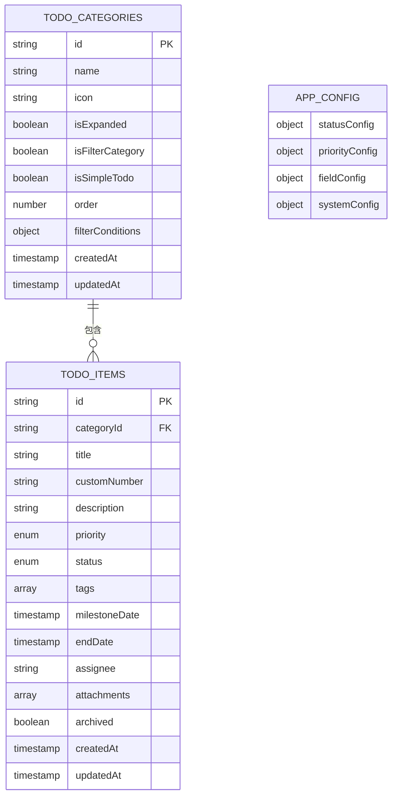
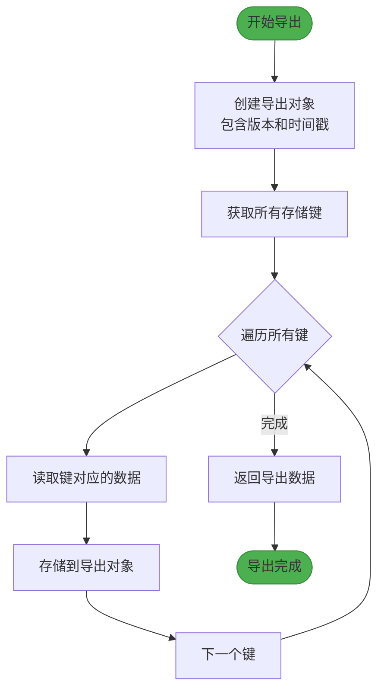
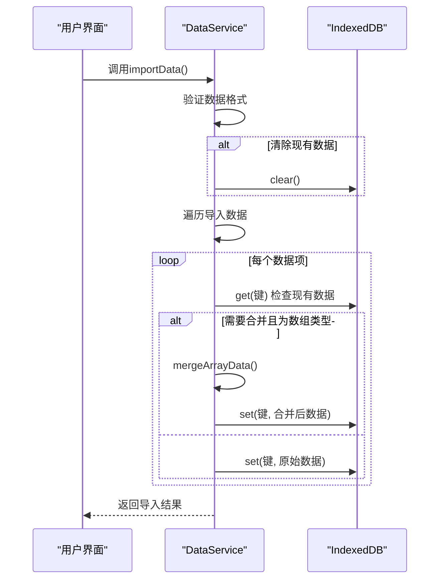
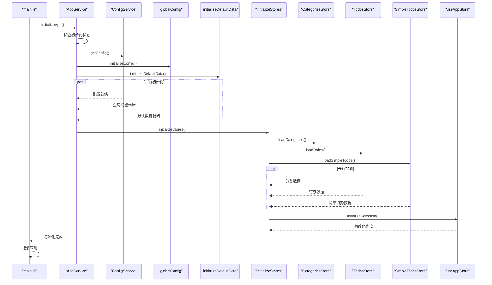

# 数据管理

<cite>
**本文档引用的文件**   
- [dataService.js](file://src/services/dataService.js)
- [configService.js](file://src/services/configService.js)
- [useAppStore.js](file://src/stores/useAppStore.js)
- [appService.js](file://src/services/appService.js)
- [todoService.js](file://src/services/todoService.js)
- [errorHandler.js](file://src/utils/errorHandler.js)
- [main.js](file://src/main.js)
</cite>

## 目录
1. [简介](#简介)
2. [数据持久化机制](#数据持久化机制)
3. [数据导入导出功能](#数据导入导出功能)
4. [配置数据管理](#配置数据管理)
5. [应用初始化流程](#应用初始化流程)
6. [实际操作示例](#实际操作示例)
7. [常见问题与解决方案](#常见问题与解决方案)
8. [安全性考虑](#安全性考虑)

## 简介

本文档全面介绍TidyDo应用的数据管理功能，重点阐述基于IndexedDB的本地持久化机制、数据导入导出与备份恢复功能、配置数据管理以及应用启动时的数据初始化流程。文档旨在为开发者和用户提供深入的技术细节和实用操作指南，确保数据的安全性、完整性和可移植性。

## 数据持久化机制

TidyDo应用采用IndexedDB作为本地数据持久化存储方案，通过`idb-keyval`库提供简洁的键值对存储接口，实现高效的数据读写操作。

### 存储架构

应用的数据存储采用分层设计，将不同类型的数据分别存储在不同的键下，便于管理和维护：

- **待办事项分类**：使用`TODO_CATEGORIES_KEY`作为键存储所有分类数据
- **待办事项**：使用`TODO_ITEMS_KEY`作为键存储所有待办事项数据
- **应用配置**：使用`CONFIG_KEY`作为键存储应用配置信息



**Diagram sources**
- [todoService.js](file://src/services/todoService.js#L10-L313)
- [configService.js](file://src/services/configService.js#L10-L205)

### 数据访问模式

应用通过服务类封装数据访问逻辑，提供统一的API接口：

- **DataService**：负责数据的导入导出和备份恢复
- **ConfigService**：管理应用配置数据
- **CategoryService** 和 **TodoItemService**：分别管理分类和待办事项数据

这种分层架构确保了数据访问的安全性和一致性，同时便于功能扩展和维护。

**Section sources**
- [dataService.js](file://src/services/dataService.js#L1-L273)
- [configService.js](file://src/services/configService.js#L1-L205)
- [todoService.js](file://src/services/todoService.js#L1-L313)

## 数据导入导出功能

dataService提供了完整的数据导入导出功能，支持用户在不同设备间迁移数据或进行定期备份。

### 数据导出实现

`DataService.exportAllData()`方法实现了数据导出功能，其工作流程如下：

1. 创建包含版本信息和时间戳的导出对象
2. 获取IndexedDB中所有存储的键
3. 遍历所有键，读取对应的数据值
4. 将所有数据组织成结构化的JSON对象返回



**Diagram sources**
- [dataService.js](file://src/services/dataService.js#L13-L35)

### 数据导入实现

`DataService.importData()`方法实现了数据导入功能，支持多种导入模式：

- **覆盖模式**：清除现有数据后导入新数据
- **合并模式**：保留现有数据，智能合并新数据
- **智能合并策略**：对于分类和待办事项，按ID去重合并，避免数据重复



**Diagram sources**
- [dataService.js](file://src/services/dataService.js#L46-L86)

### 文件保存策略

dataService采用渐进式文件保存策略，优先使用现代浏览器的File System Access API，回退到传统的下载方式：

1. 检查浏览器是否支持File System Access API
2. 如果支持，使用`showSaveFilePicker`让用户选择保存位置
3. 如果不支持或用户取消，回退到`Blob`和`a`标签的下载方式

这种策略既提供了更好的用户体验，又保证了功能的广泛兼容性。

**Section sources**
- [dataService.js](file://src/services/dataService.js#L98-L250)

## 配置数据管理

configService负责管理应用的配置数据，采用默认配置与用户配置合并的策略，确保配置的完整性和向后兼容性。

### 配置结构

应用配置分为四个主要部分：

- **状态配置**：定义待办事项的状态及其显示样式
- **优先级配置**：定义优先级级别及其视觉表现
- **字段配置**：控制表单字段的显示和必填属性
- **系统配置**：管理主题、语言等全局设置

```mermaid
classDiagram
class ConfigService {
+getConfig() Promise~Object~
+saveConfig(config) Promise~Object~
+resetToDefault() Promise~Object~
+mergeConfig(default, user) Object
}
class DEFAULT_CONFIG {
+statusConfig Object
+priorityConfig Object
+fieldConfig Object
+systemConfig Object
}
ConfigService --> DEFAULT_CONFIG : "包含"
ConfigService ..> "idb-keyval" : "使用"
```

**Diagram sources**
- [configService.js](file://src/services/configService.js#L70-L205)

### 配置合并策略

`ConfigService.mergeConfig()`方法实现了深度配置合并，其核心逻辑包括：

1. 遍历默认配置的所有属性
2. 对于对象类型的属性，递归合并
3. 保留用户配置中的自定义属性
4. 确保所有配置项都有默认值

这种策略确保了新版本应用添加的配置项能够自动包含，同时保留用户的个性化设置。

### 错误处理机制

配置服务集成了统一的错误处理机制，通过`withErrorHandling`装饰器包装所有异步操作：

- 捕获存储操作中的异常
- 提供用户友好的错误信息
- 记录详细的错误日志用于调试

**Section sources**
- [configService.js](file://src/services/configService.js#L88-L205)
- [errorHandler.js](file://src/utils/errorHandler.js#L1-L109)

## 应用初始化流程

useAppStore在应用启动时协调数据初始化流程，确保所有数据正确加载并建立正确的状态关系。

### 初始化时序

应用的初始化流程由`AppService.initializeApp()`方法协调，遵循严格的时序：

1. 并行初始化基础服务（配置、全局配置、默认数据）
2. 初始化Pinia stores（分类、待办事项、简单待办事项）
3. 基于加载的数据初始化应用状态



**Diagram sources**
- [appService.js](file://src/services/appService.js#L46-L92)
- [main.js](file://src/main.js#L44-L45)

### 状态协调机制

useAppStore通过`initializeSelection()`方法协调初始化后的状态：

1. 检查是否有选中的分类
2. 如果没有，自动选择第一个分类
3. 如果当前选中的分类不存在，选择第一个可用分类

这种机制确保了应用在任何状态下都能提供一致的用户体验。

### 依赖关系管理

初始化流程精心管理了各组件间的依赖关系：

- 配置服务必须在stores之前初始化，因为stores可能依赖配置
- 默认数据初始化必须在stores加载之前完成
- 应用状态初始化必须在所有数据加载完成后进行

**Section sources**
- [appService.js](file://src/services/appService.js#L0-L169)
- [useAppStore.js](file://src/stores/useAppStore.js#L250-L258)
- [main.js](file://src/main.js#L44-L45)

## 实际操作示例

### 导出数据到JSON文件

用户可以通过以下步骤将数据导出到JSON文件：

1. 调用`DataService.exportAllData()`获取所有数据
2. 调用`DataService.saveFileWithSystemAPI()`保存为文件
3. 选择保存位置并确认

```javascript
// 示例代码
try {
  const data = await DataService.exportAllData();
  const success = await DataService.saveFileWithSystemAPI(
    data, 
    'tidydo-backup-2024-01-01.json'
  );
  if (success) {
    console.log('数据备份成功！');
  }
} catch (error) {
  console.error('备份失败：', error.message);
}
```

### 在新设备上恢复数据

在新设备上恢复数据的步骤：

1. 选择之前导出的JSON备份文件
2. 调用`DataService.readJSONFile()`读取文件内容
3. 调用`DataService.importData()`导入数据
4. 选择"合并数据"选项保留现有数据

```javascript
// 示例代码
try {
  const file = document.getElementById('backup-file').files[0];
  const data = await DataService.readJSONFile(file);
  const result = await DataService.importData(data, {
    clearExisting: false,
    mergeData: true
  });
  console.log('数据恢复成功：', result);
  // 重新加载应用数据
  AppService.reloadAppData();
} catch (error) {
  console.error('恢复失败：', error.message);
}
```

**Section sources**
- [dataService.js](file://src/services/dataService.js#L13-L250)

## 常见问题与解决方案

### 数据损坏处理

当遇到数据损坏问题时，可以采取以下措施：

1. **验证数据完整性**：检查JSON文件是否有效
2. **使用备份恢复**：从最近的备份文件恢复数据
3. **重置到默认状态**：使用`ConfigService.resetToDefault()`重置配置

### 版本迁移兼容性

为确保版本迁移的兼容性，应用采用以下策略：

- **版本标记**：在导出数据中包含版本信息
- **默认配置合并**：新版本的默认配置会与用户配置合并
- **数据结构向后兼容**：避免破坏性的数据结构变更

### 性能优化建议

对于大量数据的处理，建议：

- **分批处理**：对于大量数据的导入导出，考虑分批处理
- **进度反馈**：为长时间操作提供进度指示
- **异步操作**：确保所有数据操作都在异步上下文中执行

**Section sources**
- [dataService.js](file://src/services/dataService.js#L1-L273)
- [configService.js](file://src/services/configService.js#L1-L205)

## 安全性考虑

### 敏感数据保护

虽然TidyDo主要处理本地数据，但仍需考虑以下安全措施：

- **避免存储敏感信息**：不建议在待办事项中存储密码等敏感信息
- **浏览器存储安全**：依赖浏览器的同源策略保护数据
- **数据加密**：如有需要，可在导出前对敏感数据进行加密

### 错误信息处理

应用采用安全的错误处理策略：

- **用户友好信息**：向用户显示简洁的错误信息
- **详细日志记录**：在控制台记录详细的错误信息用于调试
- **防止信息泄露**：不将内部错误细节暴露给用户

### 权限管理

- **存储权限**：应用需要IndexedDB存储权限
- **文件系统权限**：现代文件保存API需要用户明确授权
- **最小权限原则**：仅请求必要的权限

**Section sources**
- [errorHandler.js](file://src/utils/errorHandler.js#L1-L109)
- [dataService.js](file://src/services/dataService.js#L1-L273)