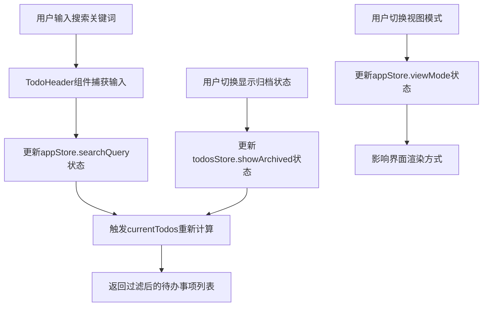
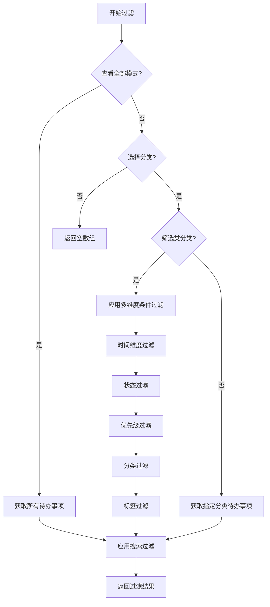

# 智能筛选

<cite>
**Referenced Files in This Document**  
- [TodoHeader.vue](file://src/views/tidyDo/components/TodoHeader.vue)
- [useAppStore.js](file://src/stores/useAppStore.js)
- [useTodosStore.js](file://src/stores/useTodosStore.js)
- [dateUtils.js](file://src/utils/dateUtils.js)
</cite>

## 目录
1. [智能筛选功能概述](#智能筛选功能概述)
2. [筛选条件的收集与管理](#筛选条件的收集与管理)
3. [多维度条件过滤实现机制](#多维度条件过滤实现机制)
4. [实际使用示例](#实际使用示例)
5. [常见问题与排查方法](#常见问题与排查方法)
6. [性能优化建议](#性能优化建议)

## 智能筛选功能概述

智能筛选功能是TidyDo应用的核心特性之一，旨在帮助用户高效管理和定位待办事项。该功能通过结合搜索框和多维度筛选器，实现了对大量待办事项的快速过滤和精准定位。系统支持状态、优先级、分类以及四个关键时间维度（创建日期、节点日期、截止日期、更新日期）的组合查询逻辑，满足了用户在复杂项目管理中的多样化需求。

整个筛选流程由两个核心组件协同工作：`TodoHeader`组件负责收集用户的筛选条件，而`useAppStore`和`useTodosStore`这两个状态管理模块则负责执行实际的数据过滤处理。这种分离设计确保了用户界面与业务逻辑的解耦，提高了代码的可维护性和可扩展性。

**Section sources**
- [TodoHeader.vue](file://src/views/tidyDo/components/TodoHeader.vue#L1-L357)
- [useAppStore.js](file://src/stores/useAppStore.js#L1-L277)

## 筛选条件的收集与管理

筛选条件的收集主要通过`TodoHeader`组件完成，该组件位于应用界面的顶部工具栏，为用户提供直观的交互界面。组件的核心功能是管理搜索查询和视图状态，这些信息被集中存储在`useAppStore`的状态管理中。

`TodoHeader`组件包含一个搜索框，用户可以输入关键词来搜索待办事项的标题、编号、描述和标签。搜索框的值通过`v-model`双向绑定到`appStore.searchQuery`，任何输入变化都会实时更新这个状态变量。当用户输入内容时，`@update:model-value`事件会触发`appStore.setSearchQuery`方法，确保搜索状态的同步更新。

除了搜索功能，`TodoHeader`还提供了视图切换按钮组，允许用户在表格、时间线、日历和报表四种视图模式之间切换。此外，组件还包含一个"显示归档"按钮，用于切换`todosStore.showArchived`状态，控制是否在列表中显示已归档的待办事项。

所有这些筛选条件最终都被`useAppStore`中的`currentTodos`计算属性所使用。该属性是一个响应式计算属性，当任何筛选条件发生变化时，它会自动重新计算并返回过滤后的待办事项列表，确保用户界面能够实时反映最新的筛选结果。

**Diagram sources**
- [TodoHeader.vue](file://src/views/tidyDo/components/TodoHeader.vue#L1-L357)
- [useAppStore.js](file://src/stores/useAppStore.js#L1-L277)

**Section sources**
- [TodoHeader.vue](file://src/views/tidyDo/components/TodoHeader.vue#L1-L357)
- [useAppStore.js](file://src/stores/useAppStore.js#L1-L277)

## 多维度条件过滤实现机制

多维度条件过滤的核心实现在`useAppStore.js`文件中的`currentTodos`计算属性。该属性通过一系列逻辑判断和过滤操作，将原始的待办事项数据转换为符合用户筛选条件的结果集。整个过滤流程遵循严格的优先级顺序，确保结果的准确性和一致性。

首先，系统根据当前的应用模式决定基础数据集。如果处于"查看全部"模式，则使用`todosStore.todos`或`todosStore.activeTodos`作为基础数据集（取决于是否显示归档项）。如果选择了特定分类，则根据分类类型进一步处理：普通分类直接使用`getTodosByCategoryId`获取对应分类的待办事项，而筛选类则需要应用更复杂的过滤条件。

对于筛选类分类，系统会从分类的`filterConditions`中提取各种筛选条件，并逐一应用。时间维度过滤是其中最复杂的部分，系统支持四个时间字段的范围查询：截止日期(`endDate`)、节点日期(`milestoneDate`)、创建日期(`createdAt`)和更新日期(`updatedAt`)。每个时间字段都支持独立的起始和结束日期过滤，系统会将字符串格式的日期转换为`Date`对象进行比较。

状态和优先级过滤通过数组包含检查实现。系统检查待办事项的状态或优先级是否在用户选择的条件数组中。分类过滤同样采用数组包含的方式，允许用户选择多个目标分类进行筛选。标签过滤则更为复杂，需要检查待办事项的标签数组中是否存在与筛选条件匹配的标签。

最后，系统将所有基础过滤结果与搜索查询进行二次过滤。搜索功能支持全文检索，可以匹配标题、描述、标签以及编号（包括自定义编号和ID前8位）。这种分层过滤机制确保了即使在大规模数据集上也能保持良好的性能表现。

**Diagram sources**
- [useAppStore.js](file://src/stores/useAppStore.js#L1-L277)

**Section sources**
- [useAppStore.js](file://src/stores/useAppStore.js#L1-L277)

## 实际使用示例

### 示例1：项目经理的周度审查
项目经理需要审查本周所有高优先级且状态为"进行中"的待办事项。操作步骤如下：
1. 在分类列表中选择"筛选类"分类
2. 在搜索框中输入"本周"作为关键词
3. 设置时间筛选条件：截止日期范围为本周一至本周日
4. 设置状态筛选：选择"进行中"
5. 设置优先级筛选：选择"高"

系统会立即返回符合所有条件的待办事项列表，帮助项目经理快速掌握项目进度。

### 示例2：个人任务整理
用户希望找到过去一个月内创建的所有待办事项，并按更新日期排序。操作步骤如下：
1. 进入"查看全部"模式
2. 点击"显示归档"按钮以包含所有项目
3. 设置时间筛选条件：创建日期范围为一个月前至今
4. 点击"截止日期"列标题进行排序（系统会自动切换到按更新日期排序）

通过这些简单的操作，用户可以轻松整理和回顾自己的任务历史。

### 示例3：跨分类项目追踪
用户需要追踪多个相关项目中的特定标签任务。操作步骤如下：
1. 创建一个"筛选类"分类
2. 配置筛选条件：选择多个相关项目分类
3. 添加标签筛选条件，如"紧急"、"阻塞"
4. 保存筛选类并命名，如"关键路径任务"

此后，用户只需点击这个筛选类，即可一键查看所有关键路径上的任务，无需在不同分类间反复切换。

**Section sources**
- [useAppStore.js](file://src/stores/useAppStore.js#L1-L277)
- [TodoHeader.vue](file://src/views/tidyDo/components/TodoHeader.vue#L1-L357)

## 常见问题与排查方法

### 筛选结果为空的排查方法
当筛选结果为空时，可能是由以下原因导致：
1. **日期格式问题**：确保输入的日期格式正确，系统期望YYYY-MM-DD格式
2. **时间范围冲突**：检查起始日期是否晚于结束日期
3. **条件过于严格**：多个筛选条件的交集可能为空，尝试逐个移除条件以定位问题
4. **数据不存在**：确认数据库中确实存在符合预期的待办事项

### 日期范围查询的边界情况处理
系统在处理日期范围查询时需要注意以下边界情况：
- **包含性**：日期范围查询是包含边界的，即起始日期和结束日期当天的数据都会被包含
- **时间精度**：系统只比较日期部分，忽略时间部分，确保全天的数据都能被正确包含
- **空值处理**：如果待办事项缺少某个时间字段，则不会通过该字段的筛选条件
- **时区问题**：所有日期都按本地时区处理，避免跨时区带来的混淆

### 状态同步问题
有时用户可能会遇到界面显示与实际数据不一致的问题。这通常是由于：
1. **缓存延迟**：数据更新后需要时间同步到界面，等待几秒后刷新
2. **状态未保存**：确保所有更改都已点击保存按钮
3. **浏览器缓存**：尝试清除浏览器缓存或使用无痕模式

**Section sources**
- [useAppStore.js](file://src/stores/useAppStore.js#L1-L277)
- [dateUtils.js](file://src/utils/dateUtils.js#L1-L366)

## 性能优化建议

### 大规模数据筛选的性能优化
当待办事项数量达到数千条时，筛选性能可能成为瓶颈。以下是一些优化建议：

1. **索引优化**：确保数据库中对常用筛选字段（如状态、优先级、分类ID）建立索引
2. **分页加载**：对于大量数据，采用分页加载而非一次性加载所有数据
3. **缓存策略**：对常用的筛选组合结果进行缓存，避免重复计算
4. **懒加载**：只在用户实际需要时才执行复杂的筛选操作

### 前端性能优化
1. **防抖处理**：对搜索输入添加防抖，避免频繁触发筛选计算
2. **虚拟滚动**：在列表渲染时使用虚拟滚动技术，只渲染可见区域的项目
3. **计算属性优化**：确保`currentTodos`等计算属性的逻辑尽可能高效，避免不必要的重复计算
4. **异步处理**：对于特别复杂的筛选操作，考虑使用Web Worker在后台线程处理

### 查询优化
1. **条件顺序**：将选择性最强的筛选条件放在前面，尽早缩小数据集
2. **预计算**：对于常用的统计信息（如各分类任务数量），在数据变更时预计算并缓存
3. **批量操作**：避免在循环中进行数据库查询，尽量使用批量操作

通过实施这些优化措施，即使在处理上万条待办事项时，系统也能保持流畅的用户体验。

**Section sources**
- [useAppStore.js](file://src/stores/useAppStore.js#L1-L277)
- [useTodosStore.js](file://src/stores/useTodosStore.js#L1-L170)