# 核心功能

<cite>
**本文档引用的文件**
- [useDragSort.js](file://src\composables\useDragSort.js)
- [TodoEditDialog.vue](file://src\model\TodoEditDialog.vue)
- [SimpleTodoQuadrant.vue](file://src\views\tidyDo\components\SimpleTodoQuadrant.vue)
- [todoService.js](file://src\services\todoService.js)
- [dataService.js](file://src\services\dataService.js)
- [useCategoriesStore.js](file://src\stores\useCategoriesStore.js)
- [useSimpleTodosStore.js](file://src\stores\useSimpleTodosStore.js)
- [useTodosStore.js](file://src\stores\useTodosStore.js)
</cite>

## 目录
1. [简介](#简介)
2. [分类管理](#分类管理)
3. [智能筛选](#智能筛选)
4. [标签系统](#标签系统)
5. [四时间维度管理](#四时间维度管理)
6. [待办事项CRUD操作](#待办事项crud操作)
7. [归档功能](#归档功能)
8. [简单Todo四象限视图](#简单todo四象限视图)
9. [功能协同工作模式](#功能协同工作模式)
10. [使用场景与操作示例](#使用场景与操作示例)

## 简介
TidyDo是一款功能丰富的待办事项管理工具，提供全面的任务管理功能。本文档深入介绍TidyDo的核心功能实现方式和用户交互模式，帮助用户和开发者理解系统的完整功能生命周期。系统采用现代化的前端架构，基于Vue 3和Pinia状态管理，结合IndexedDB进行数据持久化，确保数据安全可靠。

## 分类管理

TidyDo的分类管理功能允许用户创建、编辑、删除和排序分类，为待办事项提供组织结构。分类不仅作为容器管理待办事项，还支持作为智能筛选器和简单Todo大类的特殊类型。

### 长按拖拽排序实现

分类的拖拽排序通过`useDragSort`组合式函数实现，采用长按触发机制避免误操作。用户需要长按分类项约500毫秒后进入拖拽模式，系统会显示拖拽线指示插入位置。


**图示来源**
- [useDragSort.js](file://src\composables\useDragSort.js#L27-L236)
- [useCategoriesStore.js](file://src\stores\useCategoriesStore.js#L4-L185)

分类的创建、更新和删除操作通过`useCategoriesStore`状态管理器协调，所有变更都会自动同步到`CategoryService`并持久化到IndexedDB。

**本节来源**
- [useCategoriesStore.js](file://src\stores\useCategoriesStore.js#L4-L185)
- [todoService.js](file://src\services\todoService.js#L0-L313)

## 智能筛选

TidyDo的智能筛选功能允许用户创建基于多维度条件的动态分类。这些筛选分类会自动显示符合特定条件的待办事项，无需手动添加。

### 筛选条件实现

智能筛选分类通过`isFilterCategory`标志位识别，并在`filterConditions`字段中存储筛选条件。支持的筛选维度包括：
- 截止日期范围（endDateFrom, endDateTo）
- 节点日期范围（milestoneDateFrom, milestoneDateTo）
- 状态（statuses）
- 分类（categories）
- 标签（tags）

当用户访问筛选分类时，系统会自动查询符合所有条件的待办事项。


**图示来源**
- [todoService.js](file://src\services\todoService.js#L0-L313)
- [useCategoriesStore.js](file://src\stores\useCategoriesStore.js#L4-L185)

**本节来源**
- [todoService.js](file://src\services\todoService.js#L0-L313)

## 标签系统

TidyDo的标签系统为待办事项提供灵活的分类和筛选能力。每个待办事项可以关联多个标签，支持在创建和编辑时添加、修改或删除标签。

### 标签实现机制

标签作为待办事项的扩展字段，存储在`tags`数组中。系统通过`TodoEditDialog`组件提供标签编辑界面，使用`v-combobox`组件支持创建新标签和选择现有标签。


**图示来源**
- [TodoEditDialog.vue](file://src\model\TodoEditDialog.vue#L0-L452)
- [todoService.js](file://src\services\todoService.js#L0-L313)

标签数据本身不单独存储，而是作为待办事项的一部分持久化。系统通过分析所有待办事项的标签使用情况，自动提供标签建议。

**本节来源**
- [TodoEditDialog.vue](file://src\model\TodoEditDialog.vue#L0-L452)
- [todoService.js](file://src\services\todoService.js#L0-L313)

## 四时间维度管理

TidyDo提供四个时间维度来管理待办事项的时间属性，帮助用户更好地规划和跟踪任务进度。

### 时间维度定义

四个时间维度包括：

1. **创建日期**（createdAt）：待办事项创建的时间戳
2. **节点日期**（milestoneDate）：任务的关键里程碑日期
3. **截止日期**（endDate）：任务必须完成的最后期限
4. **更新日期**（updatedAt）：待办事项最后修改的时间戳


**图示来源**
- [todoService.js](file://src\services\todoService.js#L0-L313)
- [TodoEditDialog.vue](file://src\model\TodoEditDialog.vue#L0-L452)

在`TodoEditDialog`组件中，节点日期和截止日期通过HTML5的`type="date"`输入框实现，提供直观的日期选择器。

**本节来源**
- [todoService.js](file://src\services\todoService.js#L0-L313)
- [TodoEditDialog.vue](file://src\model\TodoEditDialog.vue#L0-L452)

## 待办事项CRUD操作

TidyDo提供完整的待办事项创建（Create）、读取（Read）、更新（Update）和删除（Delete）操作，支持全面的任务管理。

### CRUD操作流程


**图示来源**
- [useTodosStore.js](file://src\stores\useTodosStore.js#L4-L169)
- [todoService.js](file://src\services\todoService.js#L0-L313)

所有CRUD操作都通过`useTodosStore`状态管理器协调，确保UI与数据状态保持同步。

**本节来源**
- [useTodosStore.js](file://src\stores\useTodosStore.js#L4-L169)
- [todoService.js](file://src\services\todoService.js#L0-L313)

## 归档功能

TidyDo的归档功能允许用户将已完成或不再需要的待办事项移出主视图，同时保留其历史记录。

### 归档机制实现

归档功能通过`archived`布尔字段实现，而不是物理删除待办事项。这使得用户可以随时恢复归档的事项。

```mermaid
sequenceDiagram
participant 用户
participant UI
participant Store
participant 服务层
用户->>UI : 点击归档按钮
UI->>Store : toggleTodoArchived(todo)
Store->>Store : 创建更新后的待办对象
Store->>服务层 : TodoItemService.save(updatedTodo)
服务层->>数据存储 : 更新IndexedDB中的事项
数据存储-->>服务层 : 操作成功
服务层-->>Store : 返回成功
Store-->>UI : 更新状态
UI-->>用户 : 刷新界面显示
用户->>UI : 切换"显示归档"开关
UI->>Store : toggleShowArchived()
Store->>Store : 更新showArchived状态
Store->>UI : 重新计算activeTodos和archivedTodos
UI-->>用户 : 显示/隐藏归档事项
```



**图示来源**
- [useTodosStore.js](file://src\stores\useTodosStore.js#L4-L169)
- [todoService.js](file://src\services\todoService.js#L0-L313)

`useTodosStore`中的`getTodosByCategoryId`计算属性会根据`showArchived`状态过滤结果，决定是否包含已归档的事项。

**本节来源**
- [useTodosStore.js](file://src\stores\useTodosStore.js#L4-L169)

## 简单Todo四象限视图

TidyDo独特的简单Todo四象限视图提供了一种直观的任务管理方式，将任务分为四个状态象限。

### 四象限视图实现

四象限视图通过`SimpleTodoQuadrant`组件实现，采用网格布局展示四个状态：待办、进行中、已完成和暂停。


**图示来源**
- [SimpleTodoQuadrant.vue](file://src\views\tidyDo\components\SimpleTodoQuadrant.vue#L0-L436)
- [useSimpleTodosStore.js](file://src\stores\useSimpleTodosStore.js#L8-L187)

用户可以通过拖拽在不同象限间移动事项，系统会自动更新事项的状态。每个象限使用`VueDraggable`组件实现拖拽功能，并通过`handleDragEnd`事件处理状态变更。

**本节来源**
- [SimpleTodoQuadrant.vue](file://src\views\tidyDo\components\SimpleTodoQuadrant.vue#L0-L436)
- [useSimpleTodosStore.js](file://src\stores\useSimpleTodosStore.js#L8-L187)

## 功能协同工作模式

TidyDo的各项功能协同工作，形成一个完整的任务管理系统。本节介绍主要功能如何相互配合。

### 查看全部模式下的搜索与筛选

在查看全部模式下，用户可以结合搜索和筛选功能精确定位待办事项。

```mermaid
flowchart TD
    Start([查看全部模式]) --> ShowAll["显示所有未归档的待办事项"]
    
    subgraph 搜索功能
        ShowAll --> SearchInput["用户输入搜索关键词"]
        SearchInput --> FilterByTitle["按标题过滤"]
        FilterByTitle --> DisplayFiltered["显示过滤结果"]
    end
    
    subgraph 筛选功能
        ShowAll --> SelectFilter["选择筛选条件"]
        SelectFilter --> ApplyFilter["应用多维度筛选"]
        ApplyFilter --> DisplayFiltered
    end
    
    subgraph 协同工作
        SearchInput --> CombineWithFilter["与