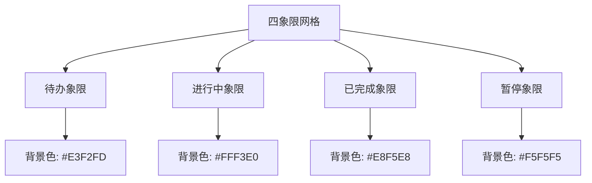
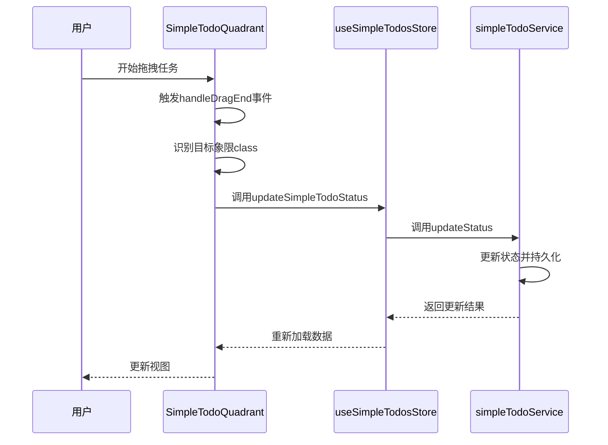
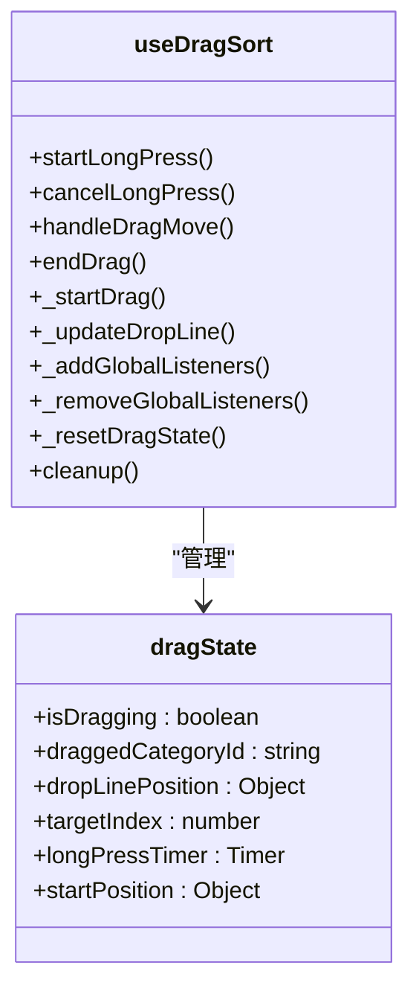
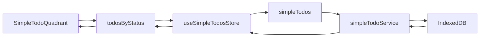

<cite>
**本文档中引用的文件**
- [SimpleTodoQuadrant.vue](file://src/views/tidyDo/components/SimpleTodoQuadrant.vue)
- [useDragSort.js](file://src/composables/useDragSort.js)
- [useSimpleTodosStore.js](file://src/stores/useSimpleTodosStore.js)
- [simpleTodoService.js](file://src/services/simpleTodoService.js)
</cite>

## 目录
1. [四象限视图](#四象限视图)
2. [核心组件分析](#核心组件分析)
3. [艾森豪威尔矩阵实现](#艾森豪威尔矩阵实现)
4. [拖拽交互设计](#拖拽交互设计)
5. [状态同步机制](#状态同步机制)
6. [使用场景示例](#使用场景示例)
7. [常见问题与解决方案](#常见问题与解决方案)
8. [响应式布局适配](#响应式布局适配)

## 四象限视图

四象限视图是TidyDo应用中的核心任务管理界面，通过艾森豪威尔矩阵原理将待办事项按紧急性和重要性划分为四个区域。该视图由`SimpleTodoQuadrant`组件实现，结合拖拽排序功能和状态管理机制，为用户提供直观、高效的任务优先级管理体验。

## 核心组件分析

### SimpleTodoQuadrant 组件

`SimpleTodoQuadrant`组件是四象限视图的核心实现，负责渲染四个任务区域并处理用户交互。该组件通过计算属性从全局状态中获取分类任务数据，并使用VueDraggable实现跨象限拖拽功能。

**Section sources**
- [SimpleTodoQuadrant.vue](file://src/views/tidyDo/components/SimpleTodoQuadrant.vue#L1-L437)

### useDragSort 组合式函数

`useDragSort`是一个可复用的组合式函数，提供拖拽排序的核心逻辑和状态管理。该函数封装了长按检测、拖拽移动、位置更新等复杂交互逻辑，确保拖拽体验的流畅性和可靠性。

**Section sources**
- [useDragSort.js](file://src/composables/useDragSort.js#L1-L238)

### useSimpleTodosStore 状态管理

`useSimpleTodosStore`基于Pinia实现全局状态管理，集中管理所有简单待办事项的数据。该store提供了一系列getter和action方法，确保数据的一致性和可预测性。

**Section sources**
- [useSimpleTodosStore.js](file://src/stores/useSimpleTodosStore.js#L1-L189)

## 艾森豪威尔矩阵实现

### 四象限布局设计

`SimpleTodoQuadrant`组件采用CSS Grid布局实现四象限网格，通过`grid-template-columns`和`grid-template-rows`属性创建2×2的网格结构。每个象限具有独特的视觉样式，通过背景色和边框颜色区分不同状态。



**Diagram sources**
- [SimpleTodoQuadrant.vue](file://src/views/tidyDo/components/SimpleTodoQuadrant.vue#L1-L437)

### 任务状态分类

系统定义了四种任务状态：待办(todo)、进行中(doing)、已完成(done)和暂停(paused)。这些状态通过`SIMPLE_TODO_STATUSES`常量在`simpleTodoService.js`中定义，并与相应的视觉配置关联。

```mermaid
classDiagram
class SIMPLE_TODO_STATUSES {
+TODO : 'todo'
+DOING : 'doing'
+DONE : 'done'
+PAUSED : 'paused'
}
class SIMPLE_TODO_STATUS_CONFIG {
+todo : {label, color, textColor, icon}
+doing : {label, color, textColor, icon}
+done : {label, color, textColor, icon}
+paused : {label, color, textColor, icon}
}
SIMPLE_TODO_STATUSES --> SIMPLE_TODO_STATUS_CONFIG : "配置映射"
```

**Diagram sources**
- [simpleTodoService.js](file://src/services/simpleTodoService.js#L1-L217)

## 拖拽交互设计

### 拖拽事件处理流程

`SimpleTodoQuadrant`组件通过VueDraggable组件实现拖拽功能，`handleDragEnd`方法处理拖拽结束事件。当用户在象限间移动任务时，系统会识别目标象限并更新任务状态。



**Diagram sources**
- [SimpleTodoQuadrant.vue](file://src/views/tidyDo/components/SimpleTodoQuadrant.vue#L1-L437)
- [useSimpleTodosStore.js](file://src/stores/useSimpleTodosStore.js#L1-L189)
- [simpleTodoService.js](file://src/services/simpleTodoService.js#L1-L217)

### 拖拽状态管理

`useDragSort`函数通过`dragState`响应式对象管理拖拽过程中的各种状态，包括是否正在拖拽、被拖拽的分类ID、拖拽线位置等。这种集中式状态管理确保了拖拽逻辑的可维护性和可测试性。



**Diagram sources**
- [useDragSort.js](file://src/composables/useDragSort.js#L1-L238)

## 状态同步机制

### 数据流架构

系统采用单向数据流架构，确保状态的一致性和可预测性。`SimpleTodoQuadrant`组件通过计算属性从`useSimpleTodosStore`获取数据，任何状态变更都通过store的action方法触发，最终持久化到IndexedDB。



**Diagram sources**
- [SimpleTodoQuadrant.vue](file://src/views/tidyDo/components/SimpleTodoQuadrant.vue#L1-L437)
- [useSimpleTodosStore.js](file://src/stores/useSimpleTodosStore.js#L1-L189)
- [simpleTodoService.js](file://src/services/simpleTodoService.js#L1-L217)

### 计算属性依赖

`SimpleTodoQuadrant`组件使用`todosByStatus`计算属性，基于`useSimpleTodosStore`的`getSimpleTodosByCategoryId` getter动态过滤任务数据。当store中的数据发生变化时，计算属性会自动重新计算，确保视图的实时更新。

**Section sources**
- [SimpleTodoQuadrant.vue](file://src/views/tidyDo/components/SimpleTodoQuadrant.vue#L1-L437)
- [useSimpleTodosStore.js](file://src/stores/useSimpleTodosStore.js#L1-L189)

## 使用场景示例

### 日常任务优先级管理

用户可以将日常任务分配到不同的象限中：
- **待办象限**：重要且紧急的任务，如"提交项目报告"
- **进行中象限**：正在进行的重要任务，如"开发新功能"
- **已完成象限**：已完成的任务，用于追踪进度
- **暂停象限**：暂时搁置的任务，如"学习新技能"

当任务优先级发生变化时，用户可以通过拖拽将其移动到相应的象限，系统会自动更新任务状态并持久化存储。

## 常见问题与解决方案

### 拖拽区域识别不准

**问题描述**：在某些设备上，拖拽操作可能无法准确识别目标象限。

**解决方案**：
1. 确保`handleDragEnd`方法正确识别目标容器的class
2. 检查`_updateDropLine`方法中的坐标计算逻辑
3. 调整`DRAG_CONFIG.DRAG_THRESHOLD`阈值以适应不同设备

**Section sources**
- [SimpleTodoQuadrant.vue](file://src/views/tidyDo/components/SimpleTodoQuadrant.vue#L1-L437)
- [useDragSort.js](file://src/composables/useDragSort.js#L1-L238)

### 任务丢失问题

**问题描述**：拖拽操作后，任务可能从视图中消失。

**解决方案**：
1. 确认`updateSimpleTodoStatus`调用成功
2. 检查`loadSimpleTodos`是否在状态更新后正确重新加载数据
3. 验证IndexedDB持久化是否正常工作

**Section sources**
- [useSimpleTodosStore.js](file://src/stores/useSimpleTodosStore.js#L1-L189)
- [simpleTodoService.js](file://src/services/simpleTodoService.js#L1-L217)

## 响应式布局适配

### 小屏幕设备布局

系统通过CSS媒体查询实现响应式设计，在小屏幕设备上自动调整布局。当屏幕宽度小于768px时，四象限从2×2网格变为垂直堆叠的单列布局。

```css
@media (max-width: 768px) {
  .quadrant-grid {
    grid-template-columns: 1fr;
    grid-template-rows: repeat(4, 1fr);
    min-height: 800px;
  }
  
  .quadrant {
    min-height: 180px;
  }
}
```

这种适配策略确保了在移动设备上的可用性和可操作性，同时保持了核心功能的完整性。

**Section sources**
- [SimpleTodoQuadrant.vue](file://src/views/tidyDo/components/SimpleTodoQuadrant.vue#L1-L437)