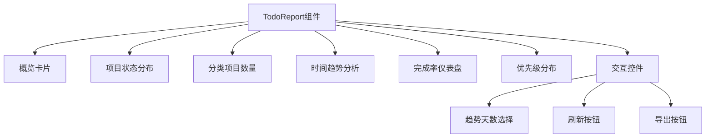
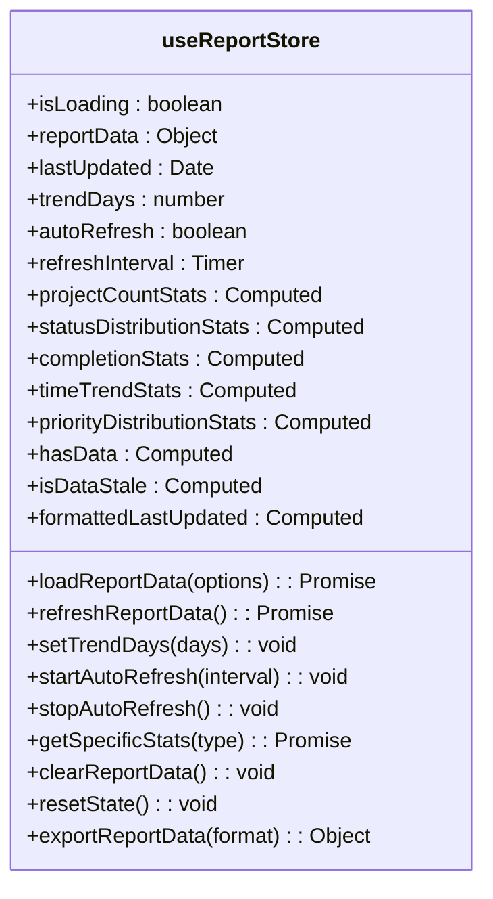
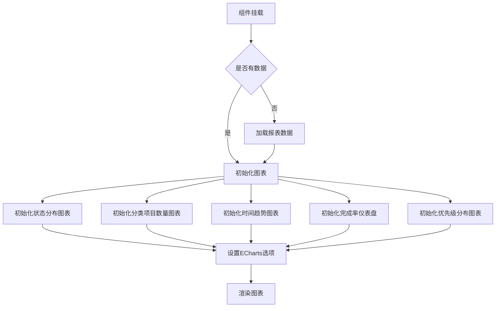

# 报表视图

<cite>
**Referenced Files in This Document**   
- [TodoReport.vue](file://src/views/tidyDo/components/TodoReport.vue)
- [reportService.js](file://src/services/reportService.js)
- [useReportStore.js](file://src/stores/useReportStore.js)
- [todoService.js](file://src/services/todoService.js)
- [simpleTodoService.js](file://src/services/simpleTodoService.js)
</cite>

## 目录
1. [简介](#简介)
2. [核心组件分析](#核心组件分析)
3. [数据聚合与统计逻辑](#数据聚合与统计逻辑)
4. [状态管理与缓存机制](#状态管理与缓存机制)
5. [图表渲染与交互流程](#图表渲染与交互流程)
6. [数据导出功能](#数据导出功能)
7. [典型分析场景](#典型分析场景)
8. [常见问题与解决方案](#常见问题与解决方案)
9. [性能优化建议](#性能优化建议)

## 简介

报表视图是TidyDo应用中的核心数据分析模块，通过可视化方式展示任务完成率、优先级分布、时间趋势等关键指标。该模块由`TodoReport`组件、`reportService`服务和`useReportStore`状态管理器三部分构成，实现了从数据聚合、状态管理到图表渲染的完整流程。用户可以通过筛选条件动态更新图表，并支持将报表数据导出为文件，为工作效率评估和任务瓶颈识别提供数据支持。

## 核心组件分析

`TodoReport`组件是报表功能的用户界面入口，负责展示统计图表和交互控件。该组件通过ECharts库渲染多种类型的统计图表，包括饼图、柱状图、折线图和仪表盘，直观呈现任务数据的多维度分析结果。



**Section sources**
- [TodoReport.vue](file://src/views/tidyDo/components/TodoReport.vue#L1-L753)

## 数据聚合与统计逻辑

`reportService`服务负责聚合原始数据并生成统计指标。该服务通过调用`TodoItemService`和`SimpleTodoService`获取所有任务数据，然后进行多维度的数据分析和统计计算。

### 项目数量统计

项目数量统计通过`getProjectCountStats`方法实现，统计总项目数、分类数量、已归档任务等指标。该方法同时统计普通Todo和简单Todo的数量，并按分类进行分组。

```mermaid
sequenceDiagram
participant ReportService
participant TodoItemService
participant SimpleTodoService
participant CategoryService
ReportService->>TodoItemService : getAll()
ReportService->>SimpleTodoService : getAll()
ReportService->>CategoryService : getAll()
TodoItemService-->>ReportService : 返回普通Todo列表
SimpleTodoService-->>ReportService : 返回简单Todo列表
CategoryService-->>ReportService : 返回分类列表
ReportService->>ReportService : 按分类统计数量
ReportService-->> : 返回项目数量统计数据
```

**Diagram sources**
- [reportService.js](file://src/services/reportService.js#L17-L79)
- [todoService.js](file://src/services/todoService.js#L144-L184)
- [simpleTodoService.js](file://src/services/simpleTodoService.js#L30-L48)

### 状态分布统计

状态分布统计通过`getStatusDistributionStats`方法实现，分析普通Todo和简单Todo的状态分布情况。普通Todo的状态包括待办、进行中、已完成和已取消，而简单Todo的状态包括待办、进行中、已完成和暂停。

**Section sources**
- [reportService.js](file://src/services/reportService.js#L85-L113)

### 完成情况统计

完成情况统计通过`getCompletionStats`方法实现，计算任务完成率指标。该方法分别计算普通Todo和简单Todo的完成率，并综合得出总体完成率。

**Section sources**
- [reportService.js](file://src/services/reportService.js#L119-L158)

### 时间趋势统计

时间趋势统计通过`getTimeTrendStats`方法实现，分析指定时间段内的任务创建和完成趋势。该方法支持动态设置统计天数，便于用户分析不同时间范围的数据。

**Section sources**
- [reportService.js](file://src/services/reportService.js#L165-L233)

### 优先级分布统计

优先级分布统计通过`getPriorityDistributionStats`方法实现，分析任务的优先级分布情况。该方法统计低、中、高和紧急四个优先级的任务数量。

**Section sources**
- [reportService.js](file://src/services/reportService.js#L239-L253)

## 状态管理与缓存机制

`useReportStore`是报表功能的状态管理器，使用Pinia实现响应式状态管理。该存储器负责缓存报表数据、管理加载状态和处理用户交互。

### 状态属性



**Diagram sources**
- [useReportStore.js](file://src/stores/useReportStore.js#L9-L247)

### 数据缓存策略

`useReportStore`实现了智能缓存策略，通过`isDataStale`计算属性判断数据是否过期（超过5分钟）。当数据过期或用户手动刷新时，才会重新从服务层获取数据，有效减少不必要的数据请求。

**Section sources**
- [useReportStore.js](file://src/stores/useReportStore.js#L45-L54)

## 图表渲染与交互流程

`TodoReport`组件利用ECharts库渲染统计图表，并通过响应式数据绑定实现动态更新。当用户更改筛选条件或刷新数据时，图表会自动重新渲染。

### 图表初始化流程



**Section sources**
- [TodoReport.vue](file://src/views/tidyDo/components/TodoReport.vue#L350-L650)

### 交互事件处理

当用户更改趋势分析天数时，`handleTrendDaysChange`方法会被触发，该方法会更新`useReportStore`中的`trendDays`值，并重新加载报表数据。

**Section sources**
- [TodoReport.vue](file://src/views/tidyDo/components/TodoReport.vue#L275-L285)

## 数据导出功能

报表组件支持将数据导出为JSON文件，便于用户进行离线分析或数据备份。导出功能通过`handleExport`方法实现，该方法调用`useReportStore`的`exportReportData`方法获取数据，然后创建Blob对象并触发下载。

**Section sources**
- [TodoReport.vue](file://src/views/tidyDo/components/TodoReport.vue#L287-L310)
- [useReportStore.js](file://src/stores/useReportStore.js#L210-L235)

## 典型分析场景

### 工作效率评估

通过完成率仪表盘和时间趋势分析图表，用户可以评估自己的工作效率。例如，观察每日任务完成数量的变化趋势，识别工作效率的高峰期和低谷期。

### 任务瓶颈识别

通过项目状态分布和优先级分布图表，用户可以识别任务瓶颈。例如，如果"进行中"状态的任务数量持续增加，可能表明存在任务积压问题。

## 常见问题与解决方案

### 图表加载失败

如果图表加载失败，可能是由于数据获取异常或ECharts初始化错误。建议检查网络连接，确保`reportService`能够正常获取数据。

### 数据统计偏差

数据统计可能出现偏差，通常是由于任务状态或优先级字段为空导致。`reportService`在统计时会为这些字段设置默认值，但仍建议用户完整填写任务信息以确保统计准确性。

## 性能优化建议

对于大数据集，建议采用以下性能优化措施：
1. 限制趋势分析的时间范围，避免加载过多历史数据
2. 实现数据分页加载，只加载当前视图所需的数据
3. 优化ECharts渲染性能，如减少图表更新频率
4. 使用Web Worker进行数据处理，避免阻塞主线程