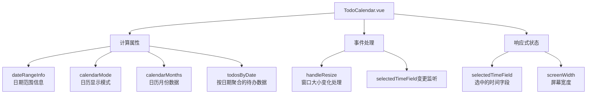
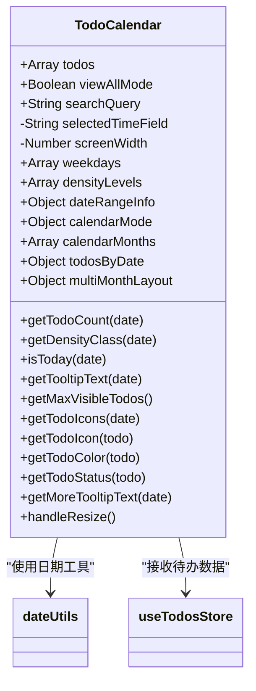
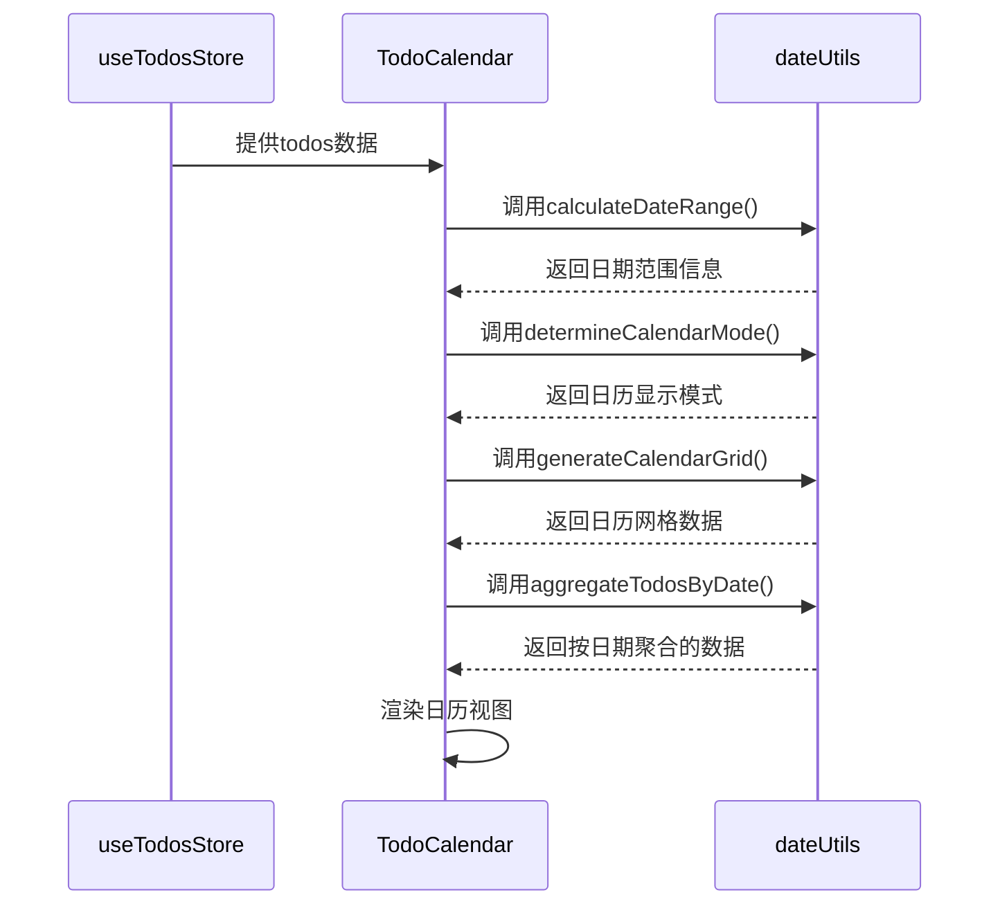
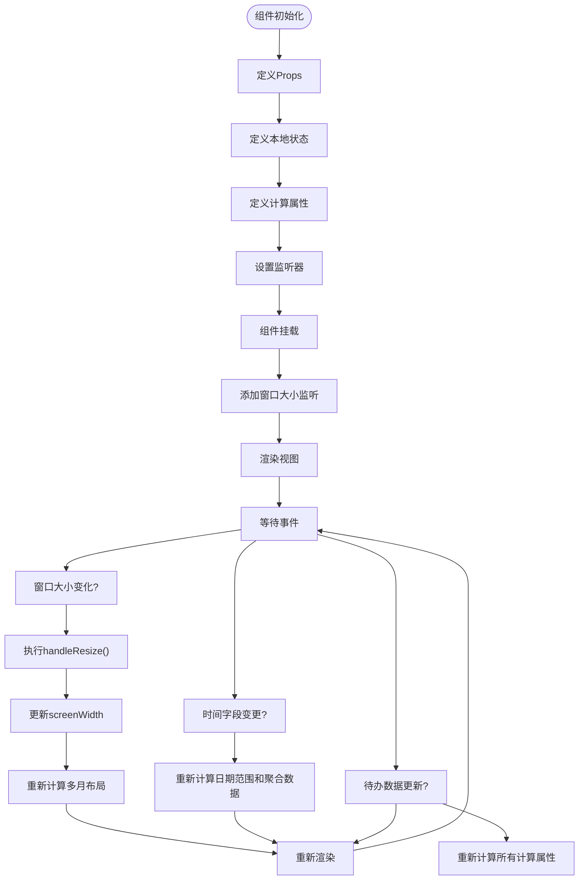
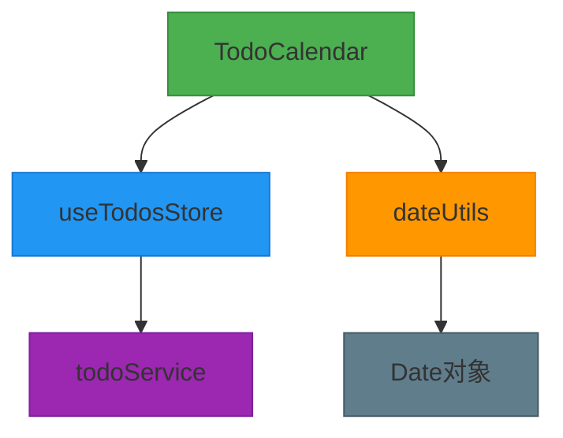
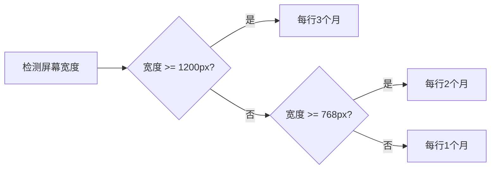

# 日历视图

<cite>
**本文档中引用的文件**
- [TodoCalendar.vue](file://src/views/tidyDo/components/TodoCalendar.vue)
- [useTodosStore.js](file://src/stores/useTodosStore.js)
- [dateUtils.js](file://src/utils/dateUtils.js)
</cite>

## 目录
1. [简介](#简介)
2. [项目结构](#项目结构)
3. [核心组件](#核心组件)
4. [架构概述](#架构概述)
5. [详细组件分析](#详细组件分析)
6. [依赖分析](#依赖分析)
7. [性能考虑](#性能考虑)
8. [故障排除指南](#故障排除指南)
9. [结论](#结论)

## 简介
TodoCalendar 组件为用户提供了一个直观的日历界面，用于可视化和管理待办事项。该组件支持按日、周、月等不同时间维度查看任务，并通过智能算法自动调整显示范围。日历视图能够高亮显示有任务的日期，支持点击跳转到具体任务列表，并实现了与全局状态 store 的无缝数据联动。本文档将深入解析该组件的设计原理、实现机制和使用方法。

## 项目结构
TodoCalendar 组件位于 `src/views/tidyDo/components/` 目录下，作为 TidyDo 应用的核心视图之一。该组件依赖于 `useTodosStore` 状态管理模块获取待办事项数据，并通过 `dateUtils.js` 工具库进行日期计算和格式化处理。整个日历系统的实现遵循了模块化设计原则，各功能职责清晰分离。

```mermaid
graph TB
subgraph "视图层"
TodoCalendar["TodoCalendar.vue<br>日历视图组件"]
end
subgraph "状态层"
useTodosStore["useTodosStore.js<br>待办事项状态管理"]
end
subgraph "工具层"
dateUtils["dateUtils.js<br>日期处理工具"]
end
TodoCalendar --> useTodosStore : "获取待办数据"
TodoCalendar --> dateUtils : "日期计算与格式化"
```

**Diagram sources**
- [TodoCalendar.vue](file://src/views/tidyDo/components/TodoCalendar.vue#L1-L788)
- [useTodosStore.js](file://src/stores/useTodosStore.js#L1-L170)
- [dateUtils.js](file://src/utils/dateUtils.js#L1-L366)

**Section sources**
- [TodoCalendar.vue](file://src/views/tidyDo/components/TodoCalendar.vue#L1-L788)
- [useTodosStore.js](file://src/stores/useTodosStore.js#L1-L170)
- [dateUtils.js](file://src/utils/dateUtils.js#L1-L366)

## 核心组件
TodoCalendar 组件是整个日历系统的核心，负责渲染日历界面、处理用户交互和展示待办事项数据。该组件通过 props 接收待办事项列表，并利用计算属性实现高效的数据处理和视图更新。组件支持多种时间维度切换，能够根据数据的时间跨度自动调整显示模式（月视图、季度视图、半年视图或年视图）。

**Section sources**
- [TodoCalendar.vue](file://src/views/tidyDo/components/TodoCalendar.vue#L1-L788)

## 架构概述
TodoCalendar 组件采用组合式 API 设计，将逻辑与模板分离，提高了代码的可维护性。组件通过导入 `dateUtils.js` 中的工具函数，实现了日期范围计算、日历网格生成、数据聚合等核心功能。状态管理方面，组件与 `useTodosStore` 保持数据同步，确保视图能够实时反映最新的待办事项状态。



**Diagram sources**
- [TodoCalendar.vue](file://src/views/tidyDo/components/TodoCalendar.vue#L243-L420)

## 详细组件分析

### TodoCalendar 组件分析
TodoCalendar 组件实现了完整的日历功能，包括多月网格布局、日期高亮、任务密度可视化等特性。组件通过 `v-for` 指令动态生成日历网格，并根据计算属性实时更新视图。

#### 组件结构


**Diagram sources**
- [TodoCalendar.vue](file://src/views/tidyDo/components/TodoCalendar.vue#L1-L788)
- [dateUtils.js](file://src/utils/dateUtils.js#L1-L366)

#### 数据流分析


**Diagram sources**
- [TodoCalendar.vue](file://src/views/tidyDo/components/TodoCalendar.vue#L261-L287)
- [dateUtils.js](file://src/utils/dateUtils.js#L6-L192)

#### 状态管理与事件处理


**Diagram sources**
- [TodoCalendar.vue](file://src/views/tidyDo/components/TodoCalendar.vue#L243-L420)

**Section sources**
- [TodoCalendar.vue](file://src/views/tidyDo/components/TodoCalendar.vue#L1-L788)

## 依赖分析
TodoCalendar 组件与其他模块之间存在明确的依赖关系。组件依赖于 `useTodosStore` 提供待办事项数据，依赖于 `dateUtils.js` 提供日期处理功能。这种依赖关系保证了组件的单一职责原则，使其专注于视图渲染而非数据管理。



**Diagram sources**
- [TodoCalendar.vue](file://src/views/tidyDo/components/TodoCalendar.vue#L1-L788)
- [useTodosStore.js](file://src/stores/useTodosStore.js#L1-L170)
- [dateUtils.js](file://src/utils/dateUtils.js#L1-L366)

**Section sources**
- [TodoCalendar.vue](file://src/views/tidyDo/components/TodoCalendar.vue#L1-L788)
- [useTodosStore.js](file://src/stores/useTodosStore.js#L1-L170)
- [dateUtils.js](file://src/utils/dateUtils.js#L1-L366)

## 性能考虑
TodoCalendar 组件在性能方面进行了多项优化。首先，通过使用计算属性（computed properties）缓存计算结果，避免了重复计算。其次，组件采用虚拟滚动技术，只渲染可视区域内的内容，提高了大型数据集的渲染性能。此外，事件监听器在组件卸载时被正确清理，防止内存泄漏。

## 故障排除指南
### 常见问题及解决方案

#### 日历显示空白
**问题描述**：日历区域显示为空白，提示"没有待办事项"。
**可能原因**：
1. 当前筛选条件下没有匹配的待办事项
2. 数据加载失败或store未正确初始化
3. 时间字段选择不当导致无有效日期

**解决方案**：
1. 检查 `useTodosStore` 是否已正确加载数据
2. 确认待办事项对象包含有效的日期字段（endDate、createdAt等）
3. 尝试切换不同的时间维度（创建日期、截止日期等）

**Section sources**
- [TodoCalendar.vue](file://src/views/tidyDo/components/TodoCalendar.vue#L85-L95)

#### 日期偏移问题
**问题描述**：日历显示的日期与实际日期存在偏移。
**可能原因**：
1. 时区处理不当
2. 日期对象创建时未正确处理时间部分
3. 浏览器本地化设置影响

**解决方案**：
1. 确保所有日期处理都使用 UTC 时间
2. 在 `dateUtils.js` 中检查 `getDateKey` 函数的实现
3. 验证日期格式化函数是否正确处理本地时间

**Section sources**
- [dateUtils.js](file://src/utils/dateUtils.js#L298-L314)

#### 移动端适配问题
**问题描述**：在移动设备上日历显示异常或交互不流畅。
**响应式适配策略**：
1. 组件通过 `getMonthsPerRow` 函数根据屏幕宽度自动调整每行显示的月份数
2. 在小屏幕上自动切换为单月显示模式
3. 使用媒体查询优化触摸交互体验



**Section sources**
- [dateUtils.js](file://src/utils/dateUtils.js#L124-L135)
- [TodoCalendar.vue](file://src/views/tidyDo/components/TodoCalendar.vue#L650-L750)

## 结论
TodoCalendar 组件通过精心设计的架构和高效的实现，为用户提供了一个功能丰富且易于使用的日历视图。组件与 `useTodosStore` 的数据联动机制确保了视图的实时性，而 `dateUtils.js` 提供的强大日期处理能力则保证了功能的准确性。通过支持多种时间维度和智能显示模式，该组件能够适应不同场景下的需求。未来可进一步优化移动端体验和增加更多交互功能，如拖拽安排任务等。