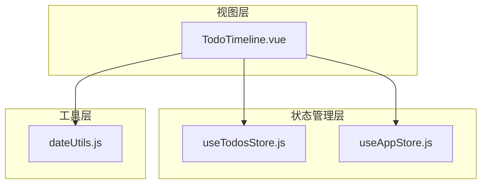
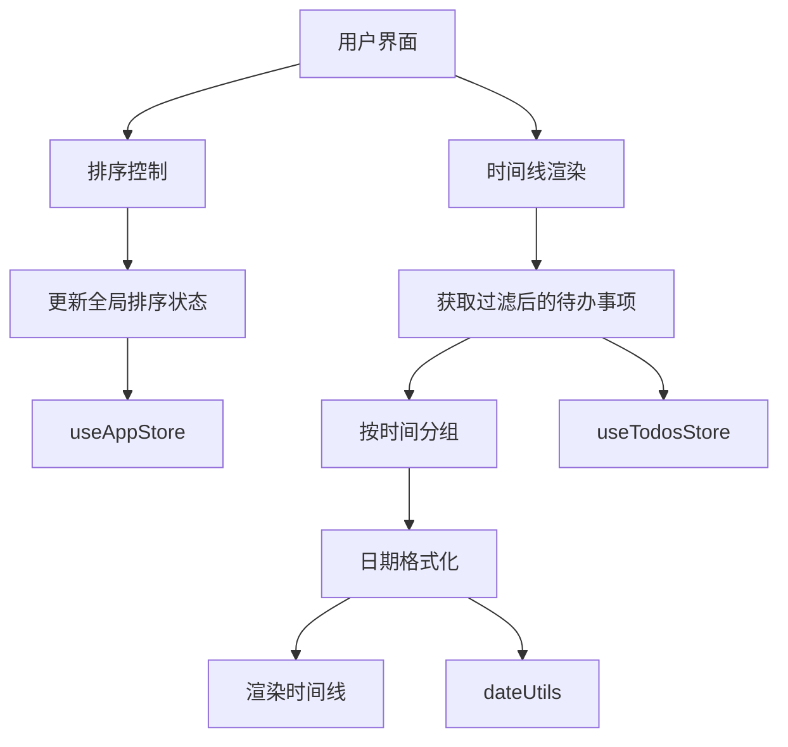
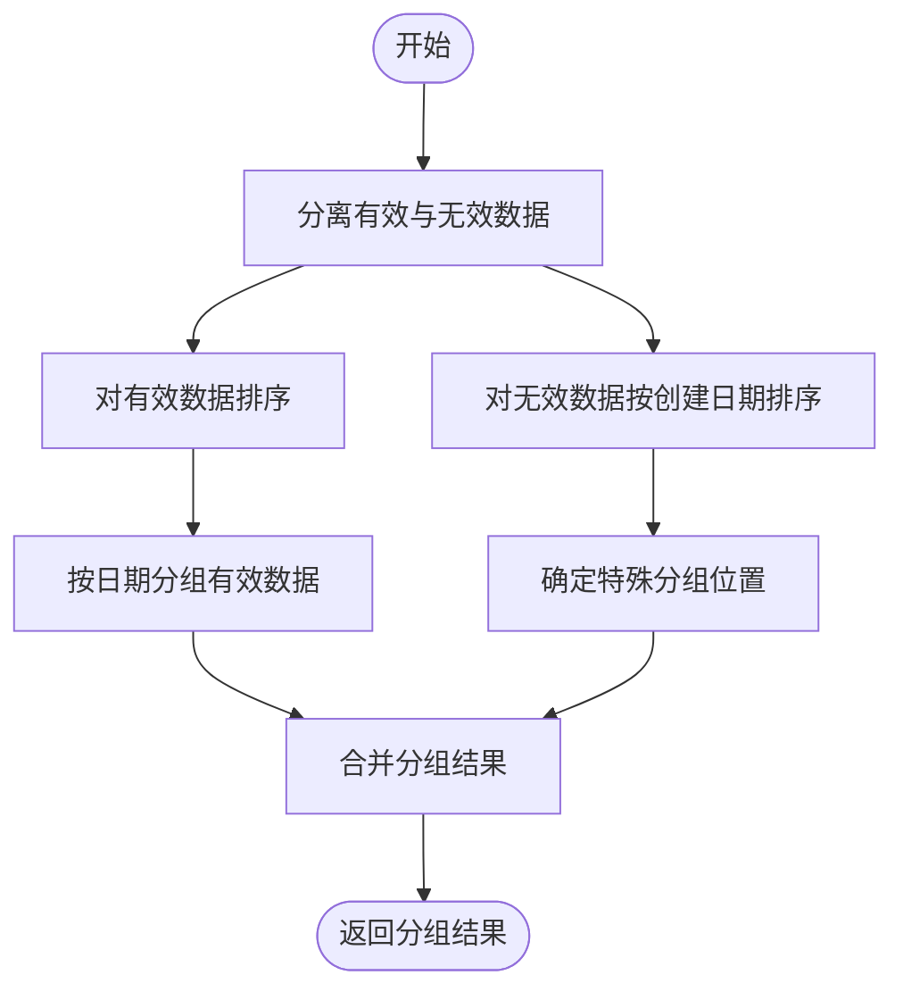
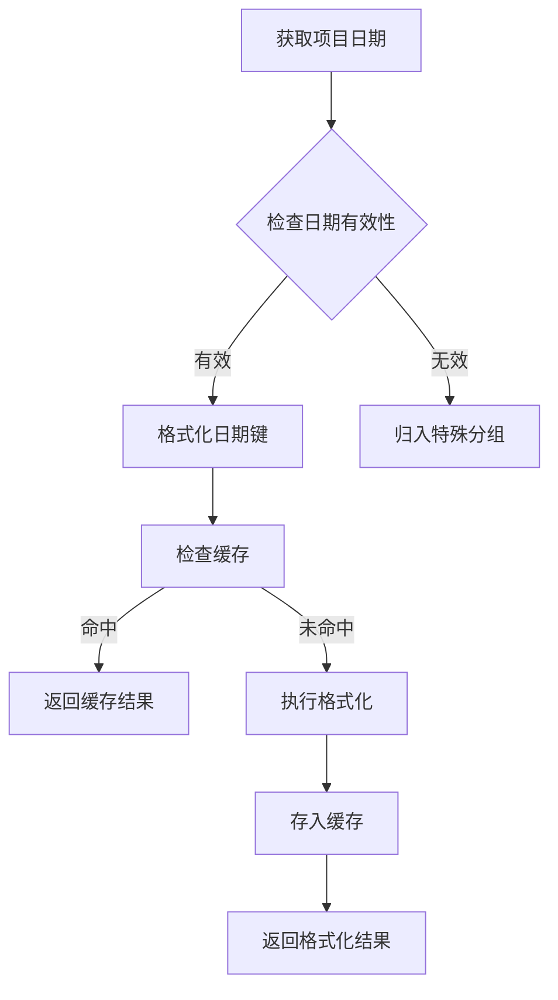
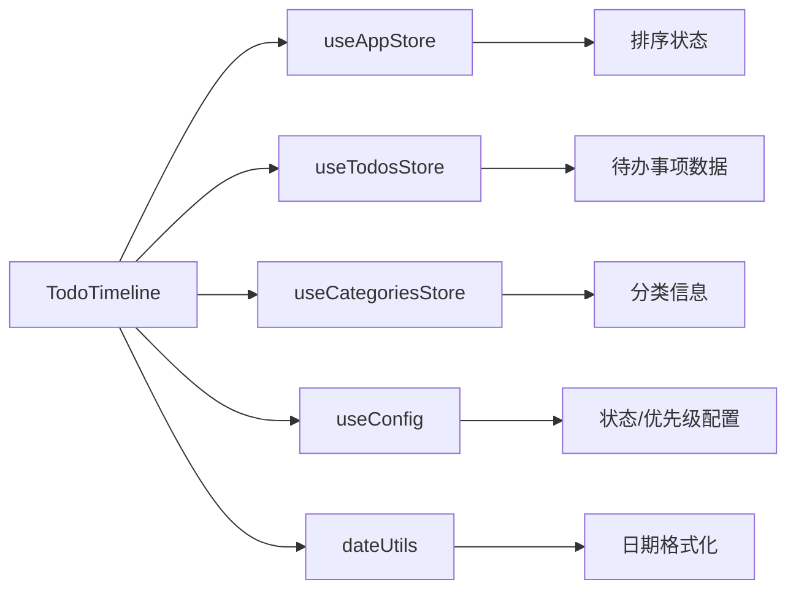

# 时间线视图

<cite>
**本文档引用文件**  
- [TodoTimeline.vue](file://src/views/tidyDo/components/TodoTimeline.vue)
- [useTodosStore.js](file://src/stores/useTodosStore.js)
- [useAppStore.js](file://src/stores/useAppStore.js)
- [dateUtils.js](file://src/utils/dateUtils.js)
- [todoService.js](file://src/services/todoService.js)
</cite>

## 目录
1. [简介](#简介)
2. [项目结构](#项目结构)
3. [核心组件](#核心组件)
4. [架构概览](#架构概览)
5. [详细组件分析](#详细组件分析)
6. [依赖分析](#依赖分析)
7. [性能考虑](#性能考虑)
8. [故障排除指南](#故障排除指南)
9. [结论](#结论)

## 简介
时间线视图是TidyDo应用中的关键功能模块，用于按时间轴组织和展示待办事项。该视图通过`TodoTimeline`组件实现，支持多种时间维度的排序与分组展示，帮助用户直观了解任务的时间分布与进度情况。组件结合`VueDraggablePlus`实现拖拽交互，并与`dateUtils`工具类协同处理日期格式化和区间计算逻辑。数据来源于`useTodosStore`，经过过滤和时间分组后进行渲染。适用于项目里程碑规划、日程安排等场景。

## 项目结构
本项目采用基于Vue 3的组合式API架构，结合Pinia进行状态管理。时间线视图相关代码位于`src/views/tidyDo/components/`目录下，核心文件包括`TodoTimeline.vue`。数据处理逻辑分布在`stores`和`utils`目录中，分别负责状态管理和日期工具函数。

**图示来源**  
- [TodoTimeline.vue](file://src/views/tidyDo/components/TodoTimeline.vue)
- [useTodosStore.js](file://src/stores/useTodosStore.js)
- [useAppStore.js](file://src/stores/useAppStore.js)
- [dateUtils.js](file://src/utils/dateUtils.js)

**本节来源**  
- [TodoTimeline.vue](file://src/views/tidyDo/components/TodoTimeline.vue)
- [useTodosStore.js](file://src/stores/useTodosStore.js)

## 核心组件
`TodoTimeline`组件是时间线视图的核心实现，负责按时间轴组织待办事项。组件接收`todos`数组作为输入，结合全局排序状态进行分组渲染。支持按创建日期、节点日期、截止日期和更新日期四种模式排序。对于无效日期的数据项，会归入特殊分组并按创建日期排序。组件内部实现了日期格式化缓存机制，避免重复计算，提升性能。

**本节来源**  
- [TodoTimeline.vue](file://src/views/tidyDo/components/TodoTimeline.vue#L1-L100)

## 架构概览
时间线视图的架构采用分层设计，自上而下分为视图层、状态管理层和工具层。视图层负责UI渲染和用户交互；状态管理层管理应用全局状态和待办事项数据；工具层提供日期处理等通用功能。组件通过Pinia store获取过滤后的待办事项数据，根据全局排序配置进行时间分组，最终渲染为时间线视图。

**图示来源**  
- [TodoTimeline.vue](file://src/views/tidyDo/components/TodoTimeline.vue)
- [useAppStore.js](file://src/stores/useAppStore.js)
- [useTodosStore.js](file://src/stores/useTodosStore.js)
- [dateUtils.js](file://src/utils/dateUtils.js)

## 详细组件分析
### TodoTimeline组件分析
`TodoTimeline`组件实现了基于时间轴的待办事项展示功能。组件通过计算属性`timelineGroups`对输入的待办事项进行分组处理，首先根据排序模式分离有效数据和无效数据，然后分别进行排序和分组。

#### 时间分组逻辑

**图示来源**  
- [TodoTimeline.vue](file://src/views/tidyDo/components/TodoTimeline.vue#L150-L250)

#### 日期处理流程

**图示来源**  
- [TodoTimeline.vue](file://src/views/tidyDo/components/TodoTimeline.vue#L250-L350)
- [dateUtils.js](file://src/utils/dateUtils.js#L200-L250)

**本节来源**  
- [TodoTimeline.vue](file://src/views/tidyDo/components/TodoTimeline.vue)
- [dateUtils.js](file://src/utils/dateUtils.js)

## 依赖分析
时间线视图组件依赖多个核心模块，形成清晰的依赖关系网络。主要依赖包括状态管理store、日期工具类和UI组件库。

**图示来源**  
- [TodoTimeline.vue](file://src/views/tidyDo/components/TodoTimeline.vue#L50-L100)
- [useAppStore.js](file://src/stores/useAppStore.js)
- [useTodosStore.js](file://src/stores/useTodosStore.js)

## 性能考虑
时间线视图在高频率更新场景下需要考虑性能优化。组件已实现日期格式化缓存机制，避免重复的日期格式化计算。建议在大量数据场景下，采用虚拟滚动技术优化渲染性能。同时，应避免在短时间内频繁触发排序状态更新，可通过防抖机制优化用户体验。

## 故障排除指南
### 时间轴错位问题
**问题描述**：时间线显示顺序与预期不符  
**解决方案**：检查待办事项的日期字段是否为有效日期对象，确保`milestoneDate`、`endDate`等字段格式正确。可通过浏览器开发者工具验证数据结构。

### 拖拽失效问题
**问题描述**：无法通过拖拽调整时间点  
**解决方案**：确认`VueDraggablePlus`已正确安装和导入。检查组件是否被正确包裹，确认`v-model`绑定的数据是否具有响应性。验证`@end`事件处理器是否正常注册。

### 渲染性能问题
**问题描述**：大量待办事项导致界面卡顿  
**解决方案**：启用虚拟滚动，仅渲染可视区域内的项目。优化日期格式化缓存大小，避免内存泄漏。考虑分页加载或懒加载策略。

**本节来源**  
- [TodoTimeline.vue](file://src/views/tidyDo/components/TodoTimeline.vue#L500-L550)
- [useAppStore.js](file://src/stores/useAppStore.js#L200-L250)

## 结论
时间线视图为用户提供了一种直观的任务时间分布展示方式。通过合理的架构设计和性能优化，实现了高效的数据处理和流畅的用户体验。组件具有良好的扩展性，可方便地添加新的排序模式或时间维度。建议在实际使用中结合具体场景进行定制化调整，以满足不同用户的需求。