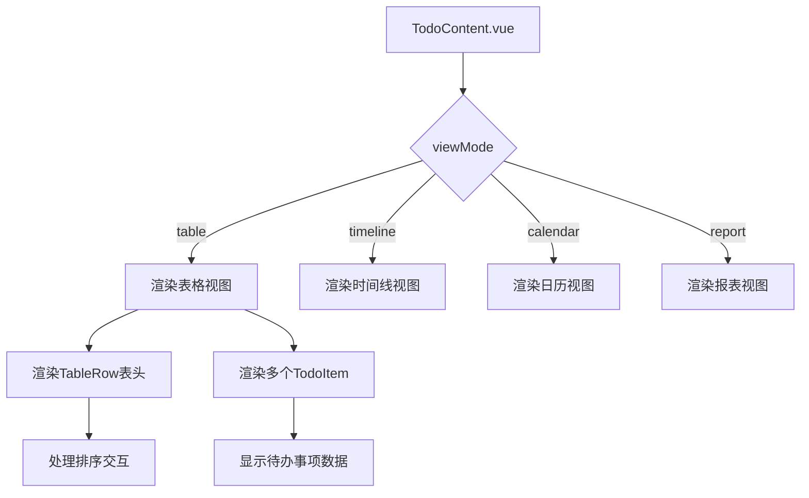
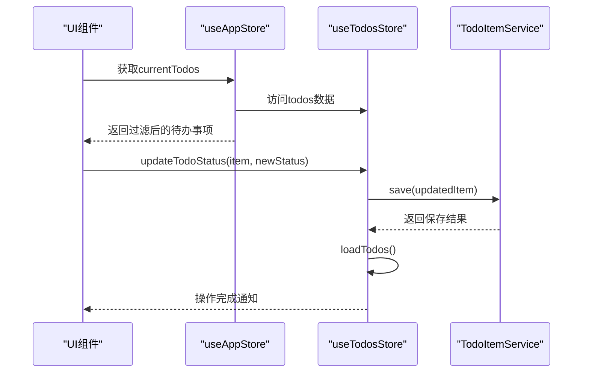
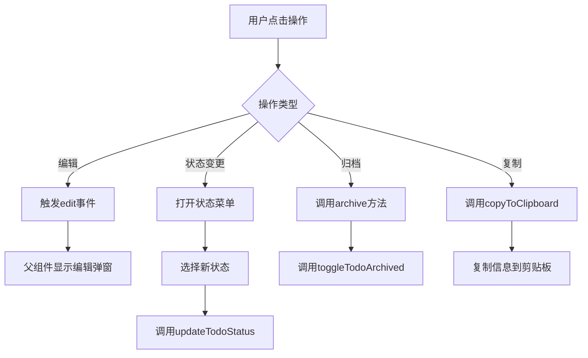

# 表格视图

<cite>
**Referenced Files in This Document**   
- [TableRow.vue](file://src/views/tidyDo/components/TableRow.vue)
- [TodoContent.vue](file://src/views/tidyDo/components/TodoContent.vue)
- [TodoItem.vue](file://src/views/tidyDo/components/TodoItem.vue)
- [useTodosStore.js](file://src/stores/useTodosStore.js)
- [useAppStore.js](file://src/stores/useAppStore.js)
</cite>

## 目录
1. [TableRow组件详解](#tablerow组件详解)
2. [TodoContent组件与视图模式](#todocontent组件与视图模式)
3. [数据同步机制](#数据同步机制)
4. [交互行为实现](#交互行为实现)
5. [性能考量与优化](#性能考量与优化)
6. [常见问题排查](#常见问题排查)

## TableRow组件详解

`TableRow`组件是表格视图的基础构建单元，负责渲染单行数据或表头。该组件通过`columns`属性接收列配置数组，支持灵活的表格结构定义。

组件根据`isHeader`属性区分表头和数据行，应用不同的样式类。表头行具有固定定位（`position: sticky`）和较高的`z-index`，确保在滚动时保持可见。数据行在鼠标悬停时显示浅色背景，提升交互体验。

对于字段展示，组件通过`v-for`指令遍历`columns`数组，为每列创建`v-col`元素。列的宽度由`cols`属性控制，对齐方式通过`getAlignmentClass`方法根据`align`属性计算得出。组件使用插槽机制（`slot`）提供内容自定义能力，允许父组件注入特定内容。

状态样式绑定通过`isArchived`属性实现，已归档的待办事项行会应用特殊的背景色（`#fffad1`），在视觉上与其他事项区分开来。

```mermaid
classDiagram
class TableRow {
+Array columns
+Boolean isHeader
+Boolean isArchived
+getAlignmentClass(align) String
}
TableRow --> "1" "0..*" TableColumn : 包含
TableColumn --> "1" "0..*" TableCell : 包含
```

**Diagram sources**
- [TableRow.vue](file://src/views/tidyDo/components/TableRow.vue#L1-L107)

**Section sources**
- [TableRow.vue](file://src/views/tidyDo/components/TableRow.vue#L1-L107)

## TodoContent组件与视图模式

`TodoContent`组件是待办事项列表的容器，负责根据当前视图模式动态渲染不同的UI结构。组件通过`useAppStore`中的`viewMode`状态决定显示哪种视图。

在表格模式下，组件首先渲染`TableRow`作为表头，并通过插槽自定义排序功能。对于"节点日期"和"截止日期"列，组件使用`v-btn`包装列标题，点击时调用`appStore.toggleSort`方法切换排序字段和顺序，并显示相应的排序图标。

待办事项数据行的渲染通过`v-for`指令遍历`sortedTodos`计算属性实现。`sortedTodos`基于`appStore.currentTodos`进行排序，排序依据由`appStore.sortBy`和`appStore.sortOrder`决定。排序逻辑优先考虑有日期值的事项，确保未设置日期的事项排在后面。



**Diagram sources**
- [TodoContent.vue](file://src/views/tidyDo/components/TodoContent.vue#L1-L384)

**Section sources**
- [TodoContent.vue](file://src/views/tidyDo/components/TodoContent.vue#L1-L384)

## 数据同步机制

表格视图的数据同步依赖于Pinia状态管理库，通过`useTodosStore`和`useAppStore`两个store实现。`useTodosStore`管理所有待办事项的原始数据，包括增删改查操作。

`useAppStore`则负责应用级别的状态管理，其中`currentTodos`计算属性是表格视图的数据源。该属性根据当前选中的分类、查看模式和搜索查询，从`useTodosStore`中过滤出相应的待办事项。

当用户执行操作（如更新状态、归档事项）时，`TodoContent`组件调用`useTodosStore`中的相应action。这些action在完成数据持久化后，会触发`loadTodos`重新加载所有数据，确保store状态与后端同步。`currentTodos`计算属性自动响应基础数据的变化，驱动UI更新。



**Diagram sources**
- [useTodosStore.js](file://src/stores/useTodosStore.js#L1-L170)
- [useAppStore.js](file://src/stores/useAppStore.js#L1-L277)

**Section sources**
- [useTodosStore.js](file://src/stores/useTodosStore.js#L1-L170)
- [useAppStore.js](file://src/stores/useAppStore.js#L1-L277)

## 交互行为实现

表格视图的交互行为主要通过`TodoItem`组件实现。每个待办事项行都是一个`TodoItem`实例，它内部使用`TableRow`组件渲染具体数据。

点击编辑行为通过操作列中的铅笔图标（`mdi-pencil`）实现。点击时触发`handleEdit`方法，通过`emit`向父组件发送`edit`事件，父组件（`TodoContent`）接收到事件后显示编辑弹窗。

拖拽排序功能在代码库中通过`VueDraggable`组件实现，但主要应用于分类列表而非待办事项列表。待办事项的排序通过表头的排序按钮控制，用户点击"节点日期"或"截止日期"列标题即可切换排序方式。

状态变更通过状态列的下拉菜单实现。用户点击状态芯片（`v-chip`）打开菜单，选择新状态后触发`handleStatusChange`方法，该方法调用`useTodosStore`的`updateTodoStatus` action完成状态更新。



**Section sources**
- [TodoItem.vue](file://src/views/tidyDo/components/TodoItem.vue#L1-L460)

## 性能考量与优化

当前代码库中未实现虚拟滚动或分页加载等针对大数据量的性能优化策略。表格视图通过`v-for`直接渲染所有匹配的待办事项，这在数据量较大时可能导致性能问题。

`currentTodos`计算属性在每次数据变化时都会重新计算过滤和排序逻辑，对于大量数据，这可能成为性能瓶颈。建议在数据量超过一定阈值（如1000条）时引入虚拟滚动技术，只渲染可视区域内的行。

虽然没有实现分页，但应用通过合理的状态管理减少了不必要的重新渲染。`currentTodos`作为计算属性，只有在其依赖项变化时才会重新计算，避免了频繁的完整列表遍历。

未来优化方向包括：
1. 引入虚拟滚动库（如`vue-virtual-scroller`）
2. 实现分页加载，按需获取数据
3. 优化排序算法，避免在每次渲染时重新排序
4. 使用`key`属性优化`v-for`的diff算法

## 常见问题排查

### 列表卡顿
列表卡顿通常由大量DOM元素渲染引起。排查步骤：
1. 检查待办事项数量，若超过500条，考虑实现虚拟滚动
2. 检查`currentTodos`计算属性的执行频率，确保没有不必要的重新计算
3. 使用浏览器性能分析工具检查重排和重绘情况

### 状态不同步
状态不同步问题可能源于：
1. `useTodosStore`的action未正确调用`loadTodos`刷新数据
2. 组件未正确监听store变化
3. 缓存数据未及时更新

解决方案是确保所有数据变更都通过store的action执行，并在action完成后调用`loadTodos`同步最新数据。

### 排序功能失效
若排序功能不工作，检查：
1. `appStore.toggleSort`方法是否正确更新`sortBy`和`sortOrder`
2. `sortedTodos`计算属性是否正确使用这些值进行排序
3. 表头按钮的`@click`事件是否正确绑定