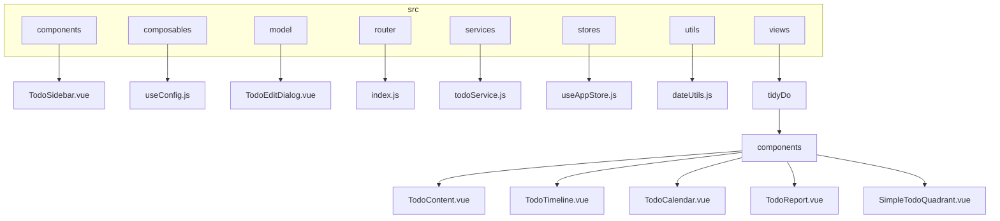
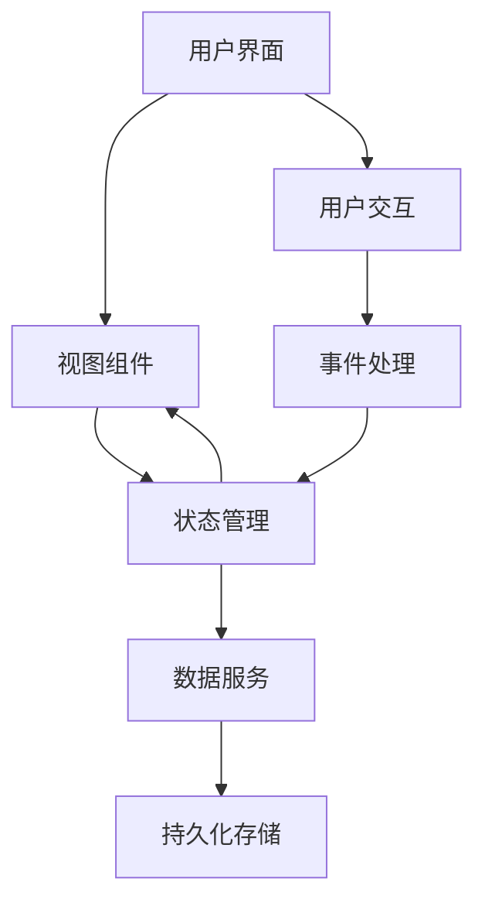
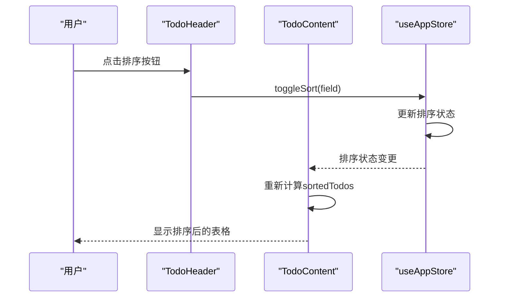
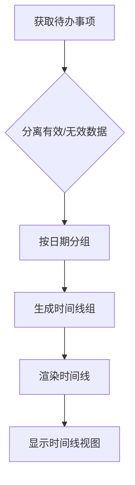
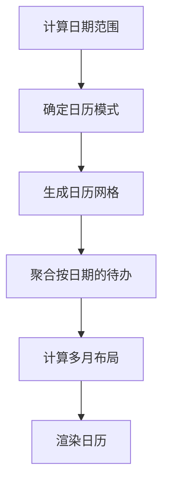
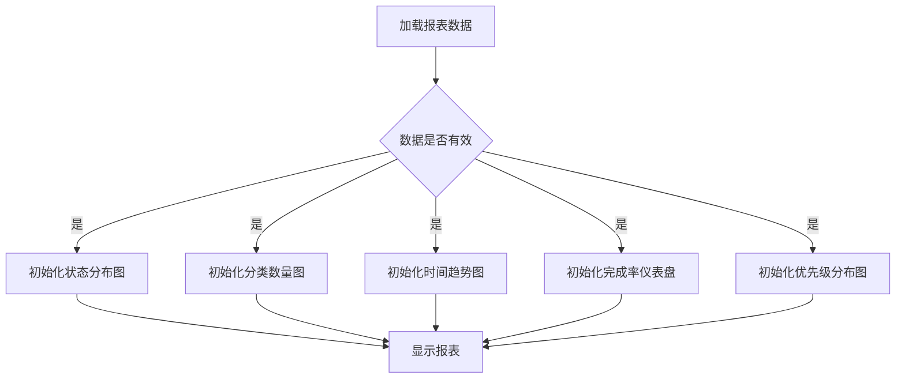
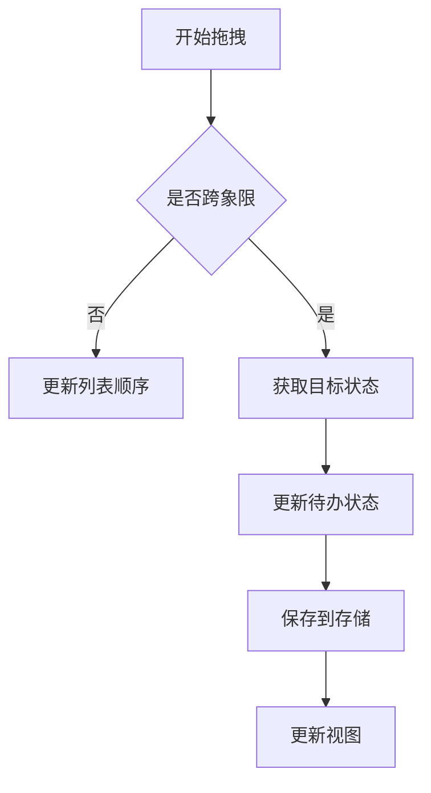
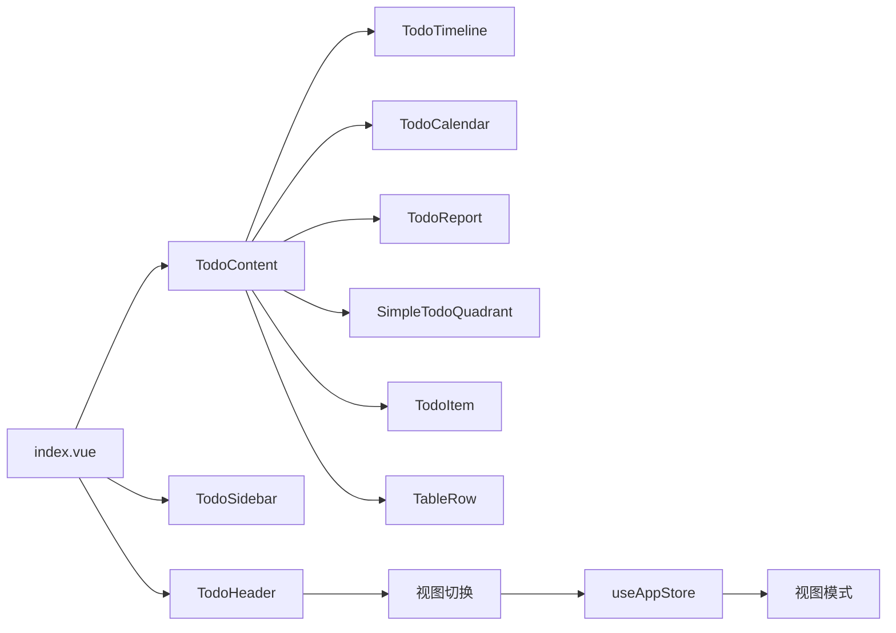

# 视图模式

<cite>
**本文档引用的文件**   
- [useAppStore.js](file://src/stores/useAppStore.js)
- [TodoContent.vue](file://src/views/tidyDo/components/TodoContent.vue)
- [TodoHeader.vue](file://src/views/tidyDo/components/TodoHeader.vue)
- [TodoTimeline.vue](file://src/views/tidyDo/components/TodoTimeline.vue)
- [TodoCalendar.vue](file://src/views/tidyDo/components/TodoCalendar.vue)
- [TodoReport.vue](file://src/views/tidyDo/components/TodoReport.vue)
- [SimpleTodoQuadrant.vue](file://src/views/tidyDo/components/SimpleTodoQuadrant.vue)
- [index.vue](file://src/views/tidyDo/index.vue)
</cite>

## 目录
1. [简介](#简介)
2. [项目结构](#项目结构)
3. [核心组件](#核心组件)
4. [架构概述](#架构概述)
5. [详细组件分析](#详细组件分析)
6. [依赖分析](#依赖分析)
7. [性能考虑](#性能考虑)
8. [故障排除指南](#故障排除指南)
9. [结论](#结论)

## 简介
本文档全面介绍TidyDo应用中的多视图模式，涵盖表格、时间线、日历、报表和简单Todo四象限视图的功能特点与技术实现。重点说明各视图组件的数据绑定方式、渲染逻辑和用户交互模式，以及如何通过路由或状态切换不同视图并保持数据一致性。

## 项目结构
TidyDo应用采用基于Vue 3和Vite的现代前端架构，使用Pinia进行状态管理，Vuetify作为UI框架。项目结构清晰，按功能模块组织，主要包含组件、组合式函数、模型、路由、服务、状态存储、工具和视图等目录。

**图源**
- [src/components/TodoSidebar.vue](file://src/components/TodoSidebar.vue)
- [src/composables/useConfig.js](file://src/composables/useConfig.js)
- [src/model/TodoEditDialog.vue](file://src/model/TodoEditDialog.vue)
- [src/router/index.js](file://src/router/index.js)
- [src/services/todoService.js](file://src/services/todoService.js)
- [src/stores/useAppStore.js](file://src/stores/useAppStore.js)
- [src/utils/dateUtils.js](file://src/utils/dateUtils.js)
- [src/views/tidyDo/components/TodoContent.vue](file://src/views/tidyDo/components/TodoContent.vue)
- [src/views/tidyDo/components/TodoTimeline.vue](file://src/views/tidyDo/components/TodoTimeline.vue)
- [src/views/tidyDo/components/TodoCalendar.vue](file://src/views/tidyDo/components/TodoCalendar.vue)
- [src/views/tidyDo/components/TodoReport.vue](file://src/views/tidyDo/components/TodoReport.vue)
- [src/views/tidyDo/components/SimpleTodoQuadrant.vue](file://src/views/tidyDo/components/SimpleTodoQuadrant.vue)

**节源**
- [src](file://src)

## 核心组件
本应用的核心组件包括视图模式管理、数据绑定、渲染逻辑和用户交互等。视图模式由useAppStore统一管理，通过viewMode状态控制当前显示的视图。各视图组件通过props接收数据，实现数据绑定和渲染。

**节源**
- [useAppStore.js](file://src/stores/useAppStore.js)
- [TodoContent.vue](file://src/views/tidyDo/components/TodoContent.vue)

## 架构概述
应用采用MVVM架构模式，通过Pinia状态管理实现数据与视图的分离。视图模式的切换通过修改全局状态实现，确保数据一致性。各视图组件独立渲染，通过事件机制与父组件通信。

**图源**
- [useAppStore.js](file://src/stores/useAppStore.js)
- [TodoContent.vue](file://src/views/tidyDo/components/TodoContent.vue)
- [TodoHeader.vue](file://src/views/tidyDo/components/TodoHeader.vue)

## 详细组件分析
### 表格视图分析
表格视图是默认视图，显示待办事项的详细信息。通过TableRow组件实现表头和数据行的渲染，支持排序和搜索功能。

#### 组件交互

**图源**
- [TodoHeader.vue](file://src/views/tidyDo/components/TodoHeader.vue)
- [TodoContent.vue](file://src/views/tidyDo/components/TodoContent.vue)
- [useAppStore.js](file://src/stores/useAppStore.js)

**节源**
- [TodoHeader.vue](file://src/views/tidyDo/components/TodoHeader.vue)
- [TodoContent.vue](file://src/views/tidyDo/components/TodoContent.vue)

### 时间线视图分析
时间线视图按时间顺序展示待办事项，支持多种排序模式。

#### 数据流

**图源**
- [TodoTimeline.vue](file://src/views/tidyDo/components/TodoTimeline.vue)

**节源**
- [TodoTimeline.vue](file://src/views/tidyDo/components/TodoTimeline.vue)

### 日历视图分析
日历视图以日历形式展示待办事项，支持多月显示和密度指示。

#### 渲染逻辑

**图源**
- [TodoCalendar.vue](file://src/views/tidyDo/components/TodoCalendar.vue)

**节源**
- [TodoCalendar.vue](file://src/views/tidyDo/components/TodoCalendar.vue)

### 报表视图分析
报表视图提供数据统计和可视化，仅在查看全部模式下显示。

#### 图表初始化

**图源**
- [TodoReport.vue](file://src/views/tidyDo/components/TodoReport.vue)

**节源**
- [TodoReport.vue](file://src/views/tidyDo/components/TodoReport.vue)

### 简单Todo四象限视图分析
四象限视图用于简单待办事项的优先级管理，支持拖拽操作。

#### 拖拽处理

**图源**
- [SimpleTodoQuadrant.vue](file://src/views/tidyDo/components/SimpleTodoQuadrant.vue)

**节源**
- [SimpleTodoQuadrant.vue](file://src/views/tidyDo/components/SimpleTodoQuadrant.vue)

## 依赖分析
应用各组件之间的依赖关系清晰，通过状态管理实现数据共享，避免了复杂的组件间通信。

**图源**
- [index.vue](file://src/views/tidyDo/index.vue)
- [TodoContent.vue](file://src/views/tidyDo/components/TodoContent.vue)
- [TodoHeader.vue](file://src/views/tidyDo/components/TodoHeader.vue)
- [useAppStore.js](file://src/stores/useAppStore.js)

**节源**
- [index.vue](file://src/views/tidyDo/index.vue)
- [TodoContent.vue](file://src/views/tidyDo/components/TodoContent.vue)
- [TodoHeader.vue](file://src/views/tidyDo/components/TodoHeader.vue)
- [useAppStore.js](file://src/stores/useAppStore.js)

## 性能考虑
应用在大数据量下的性能表现良好，通过以下方式优化性能：
- 使用计算属性缓存排序结果
- 限制日历视图中显示的图标数量
- 定期清理日期格式化缓存
- 使用虚拟滚动技术（未在代码中体现，但建议实现）

## 故障排除指南
### 视图切换卡顿
**问题**：视图切换时出现卡顿
**解决方案**：
1. 检查待办事项数量是否过多
2. 确保排序和搜索功能正确实现
3. 优化数据处理逻辑，避免重复计算

### 数据展示异常
**问题**：某些待办事项未正确显示
**解决方案**：
1. 检查数据过滤条件是否正确
2. 验证日期格式是否正确
3. 确认状态管理中的数据是否同步

**节源**
- [useAppStore.js](file://src/stores/useAppStore.js)
- [TodoContent.vue](file://src/views/tidyDo/components/TodoContent.vue)

## 结论
TidyDo应用的多视图模式设计合理，功能完整，通过状态管理实现了视图间的无缝切换和数据一致性。各视图组件职责明确，代码结构清晰，易于维护和扩展。建议进一步优化大数据量下的性能表现，如实现虚拟滚动等技术。