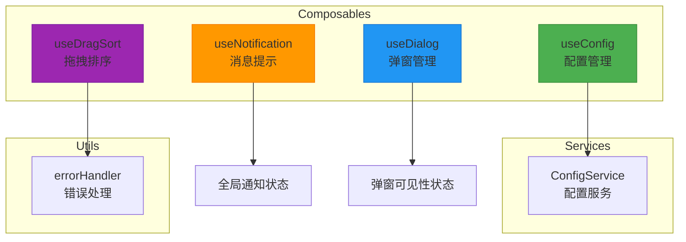
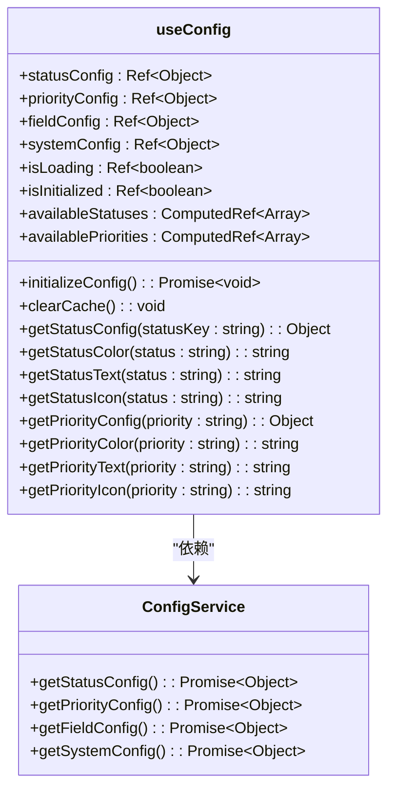
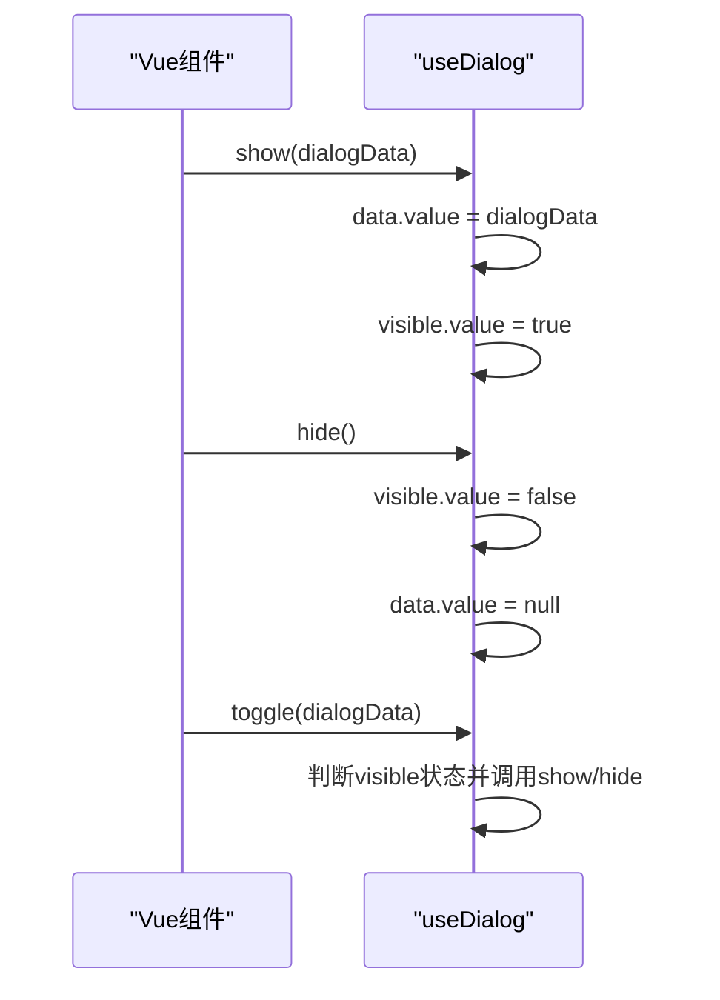
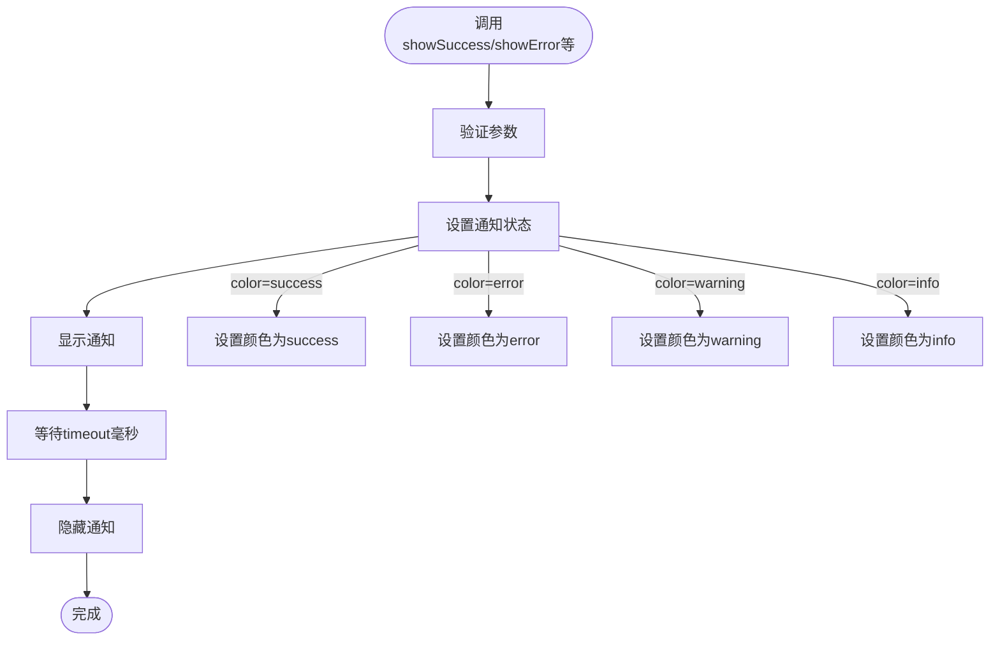
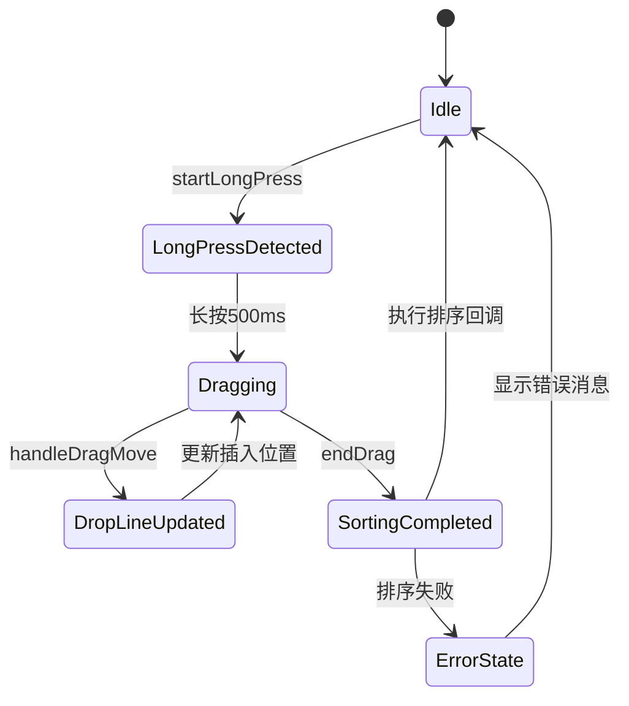
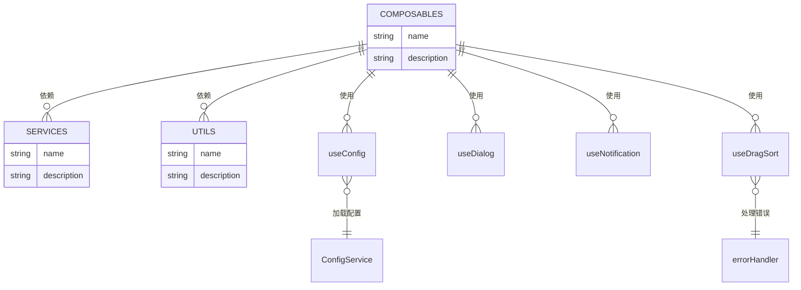

# 组合式函数

<cite>
**Referenced Files in This Document**  
- [useConfig.js](file://src/composables/useConfig.js)
- [useDialog.js](file://src/composables/useDialog.js)
- [useNotification.js](file://src/composables/useNotification.js)
- [useDragSort.js](file://src/composables/useDragSort.js)
- [index.js](file://src/composables/index.js)
</cite>

## 目录
1. [简介](#简介)
2. [核心组合式函数概览](#核心组合式函数概览)
3. [详细组件分析](#详细组件分析)
   - [useConfig: 应用配置管理](#useconfig-应用配置管理)
   - [useDialog: 弹窗状态管理](#usedialog-弹窗状态管理)
   - [useNotification: 用户消息提示](#usenotification-用户消息提示)
   - [useDragSort: 长按拖拽排序](#usedragsort-长按拖拽排序)
4. [使用指南](#使用指南)
5. [依赖关系分析](#依赖关系分析)

## 简介

TidyDo 应用通过组合式函数（Composables）封装了可复用的 UI 逻辑和状态管理功能。这些函数遵循 Vue 3 的 Composition API 设计模式，将相关的响应式状态、计算属性和方法组织在一起，提供清晰、可复用的接口。本文档详细介绍了 `useConfig`、`useDialog`、`useNotification` 和 `useDragSort` 四个核心组合式函数的实现原理和使用方法。

## 核心组合式函数概览

TidyDo 的组合式函数位于 `src/composables` 目录下，通过 `index.js` 文件统一导出，便于在应用的任何组件中导入使用。这些函数主要负责管理 UI 层的状态，与业务逻辑分离，确保代码的模块化和可维护性。



**Diagram sources**
- [useConfig.js](file://src/composables/useConfig.js#L1-L205)
- [useDialog.js](file://src/composables/useDialog.js#L1-L50)
- [useNotification.js](file://src/composables/useNotification.js#L1-L59)
- [useDragSort.js](file://src/composables/useDragSort.js#L1-L238)
- [index.js](file://src/composables/index.js#L1-L22)

**Section sources**
- [index.js](file://src/composables/index.js#L1-L22)

## 详细组件分析

### useConfig: 应用配置管理

`useConfig` 函数提供了对应用配置的响应式访问，封装了配置的加载、缓存和查询逻辑。它使用单例模式确保全局状态共享，并通过 `ConfigService` 从后端服务异步加载配置数据。



**Diagram sources**
- [useConfig.js](file://src/composables/useConfig.js#L20-L192)

**Section sources**
- [useConfig.js](file://src/composables/useConfig.js#L1-L205)

#### 功能特性
- **响应式状态**：通过 `ref` 和 `computed` 创建响应式配置状态，当配置更新时，所有使用这些状态的组件会自动更新。
- **懒加载与缓存**：配置在首次访问时异步加载，并缓存结果。后续访问直接使用缓存，提高性能。
- **自动初始化**：在浏览器环境中自动尝试初始化配置，确保应用启动时配置可用。
- **默认值处理**：当请求的配置项不存在时，返回合理的默认值，避免应用崩溃。

### useDialog: 弹窗状态管理

`useDialog` 函数提供了一套简洁的 API 来管理弹窗的显示与隐藏状态。它封装了弹窗的可见性、数据传递和状态切换逻辑，支持创建多个独立的弹窗管理器。



**Diagram sources**
- [useDialog.js](file://src/composables/useDialog.js#L2-L38)

**Section sources**
- [useDialog.js](file://src/composables/useDialog.js#L1-L50)

#### 功能特性
- **状态封装**：将弹窗的可见性（`visible`）和传递数据（`data`）封装在响应式引用中。
- **方法接口**：提供 `show`、`hide` 和 `toggle` 三个核心方法，简化弹窗状态控制。
- **多实例支持**：通过 `useMultipleDialogs` 函数可以创建多个独立的弹窗管理器，适用于复杂页面中多个弹窗的场景。

### useNotification: 用户消息提示

`useNotification` 函数实现了全局的消息提示功能，支持不同类型的提示（成功、错误、警告、信息）和自定义显示时长。它使用单例模式确保应用内只有一个全局通知状态。



**Diagram sources**
- [useNotification.js](file://src/composables/useNotification.js#L10-L58)

**Section sources**
- [useNotification.js](file://src/composables/useNotification.js#L1-L59)

#### 功能特性
- **统一状态**：全局唯一的 `notification` 状态对象，确保同一时间只有一个消息提示显示。
- **多样化提示**：提供 `showSuccess`、`showError`、`showWarning`、`showInfo` 等便捷方法，简化不同类型消息的调用。
- **自动隐藏**：消息提示在指定时间后自动隐藏，提升用户体验。

### useDragSort: 长按拖拽排序

`useDragSort` 函数实现了长按触发的拖拽排序交互逻辑，主要用于分类的重新排序。它处理了从长按检测、拖拽移动到释放排序的完整流程，并通过错误处理确保操作的健壮性。



**Diagram sources**
- [useDragSort.js](file://src/composables/useDragSort.js#L27-L236)

**Section sources**
- [useDragSort.js](file://src/composables/useDragSort.js#L1-L238)

#### 功能特性
- **长按触发**：通过 `startLongPress` 和 `cancelLongPress` 方法实现长按检测，避免误触。
- **跨平台支持**：同时支持鼠标事件（`mousemove`、`mouseup`）和触摸事件（`touchmove`、`touchend`），确保在桌面和移动设备上都能正常工作。
- **视觉反馈**：在拖拽过程中显示一条动态的插入线（`dropLinePosition`），直观地指示当前的插入位置。
- **错误处理**：使用 `withErrorHandling` 高阶函数包装 `endDrag` 方法，捕获并处理排序过程中的业务逻辑错误。
- **资源清理**：提供 `cleanup` 方法，在组件卸载时移除全局事件监听器，防止内存泄漏。

## 使用指南

要在 Vue 组件中使用这些组合式函数，请按照以下步骤操作：

1. **导入函数**：从 `@/composables` 路径导入所需的函数。
2. **调用函数**：在 `setup` 函数或 `<script setup>` 中调用组合式函数，获取返回的状态和方法。
3. **使用API**：在模板或逻辑中使用返回的响应式状态和方法。

```javascript
// 示例：在组件中使用 useNotification
import { useNotification } from '@/composables'

export default {
  setup() {
    const { showSuccess, showError } = useNotification()

    const handleSave = async () => {
      try {
        await saveData()
        showSuccess('保存成功！')
      } catch (error) {
        showError('保存失败：' + error.message)
      }
    }

    return { handleSave }
  }
}
```

## 依赖关系分析

TidyDo 的组合式函数之间相互独立，各自封装了特定的 UI 逻辑。它们主要依赖于应用的其他服务层和工具函数，形成了清晰的分层架构。



**Diagram sources**
- [useConfig.js](file://src/composables/useConfig.js#L1-L205)
- [useDialog.js](file://src/composables/useDialog.js#L1-L50)
- [useNotification.js](file://src/composables/useNotification.js#L1-L59)
- [useDragSort.js](file://src/composables/useDragSort.js#L1-L238)

**Section sources**
- [useConfig.js](file://src/composables/useConfig.js#L1-L205)
- [useDialog.js](file://src/composables/useDialog.js#L1-L50)
- [useNotification.js](file://src/composables/useNotification.js#L1-L59)
- [useDragSort.js](file://src/composables/useDragSort.js#L1-L238)