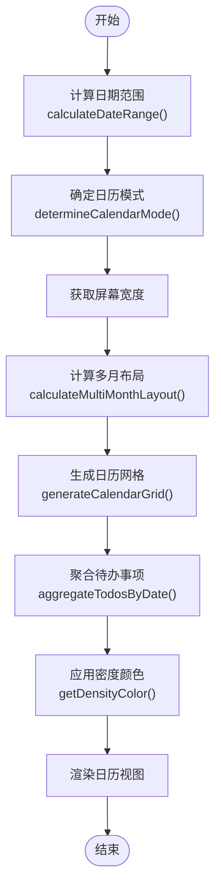

# 项目概述

<cite>
**本文档引用文件**  
- [README.md](file://README.md)
- [package.json](file://package.json)
- [vite.config.js](file://vite.config.js)
- [main.js](file://src/main.js)
- [todoService.js](file://src/services/todoService.js)
- [useTodosStore.js](file://src/stores/useTodosStore.js)
- [useDragSort.js](file://src/composables/useDragSort.js)
- [dateUtils.js](file://src/utils/dateUtils.js)
- [TodoSidebar.vue](file://src/components/TodoSidebar.vue)
- [index.vue](file://src/views/tidyDo/index.vue)
- [TodoEditDialog.vue](file://src/model/TodoEditDialog.vue)
- [dataService.js](file://src/services/dataService.js)
</cite>

## 目录
1. [项目简介](#项目简介)
2. [核心特性](#核心特性)
3. [技术栈](#技术栈)
4. [部署方式](#部署方式)
5. [快速开始](#快速开始)
6. [数据结构设计](#数据结构设计)
7. [状态管理](#状态管理)
8. [拖拽排序实现](#拖拽排序实现)
9. [日期处理功能](#日期处理功能)
10. [数据备份与恢复](#数据备份与恢复)

## 项目简介

TidyDo 是一个现代化的待办事项管理应用，采用优雅的分层架构设计，基于 Vue 3 + Vuetify 构建，具有简洁优雅的代码结构和强大的功能特性。该应用支持 Web 应用和 Chrome 扩展等多种部署方式，为用户提供灵活的使用选择。

作为一款高质量的待办事项管理工具，TidyDo 专注于提升用户的任务管理效率和体验。应用采用响应式设计，完美适配桌面和移动设备，基于 Material Design 设计语言打造现代化 UI 界面。通过优化的初始化流程和缓存机制，确保了应用的高性能运行。

**Section sources**
- [README.md](file://README.md#L1-L134)

## 核心特性

TidyDo 提供了丰富而实用的功能特性，满足用户多样化的待办事项管理需求。

### 分类管理
支持创建、编辑、删除分类，并提供长按拖拽排序功能，通过横线指示插入位置，使分类管理更加直观和便捷。

### 智能筛选
支持按状态、日期、分类、标签等多维度进行智能筛选，帮助用户快速定位所需待办事项。

### 标签系统
为待办事项添加标签，便于分类和检索，增强任务的组织性和可查找性。

### 多时间维度
支持创建日期、节点日期、截止日期、更新日期四个时间维度管理，全面记录任务的时间信息。

### 状态管理
提供待办/进行中/完成/取消等状态切换，清晰反映任务的执行进度。

### 归档功能
支持归档已完成的待办事项，保持任务列表的整洁，同时保留历史记录。

### 简单Todo
提供轻量级四象限待办管理，支持拖拽状态切换和内联编辑，满足快速记录和管理简单任务的需求。

### 数据同步与备份
基于 IndexedDB 实现本地数据持久化，确保数据安全；支持一键导出备份，保护用户数据。

**Section sources**
- [README.md](file://README.md#L10-L50)

## 技术栈

TidyDo 采用现代化的前端技术栈，确保应用的高性能和可维护性。

### 前端框架
使用 **Vue 3 (Composition API)** 作为核心前端框架，利用其响应式系统和组合式 API 提供高效的开发体验。

### UI 组件库
采用 **Vuetify 3** 作为 UI 组件库，基于 Material Design 设计语言，提供一致且美观的用户界面。

### 状态管理
使用 **Pinia** 结合 Vue 3 响应式系统进行状态管理，提供类型安全、模块化的状态管理解决方案。

### 路由
采用 **Vue Router 4** 实现应用的路由管理，支持动态路由和导航守卫。

### 样式
使用 **SCSS + Vuetify + Tailwind CSS** 进行样式设计，结合实用优先的 Tailwind CSS 和组件化的 Vuetify，实现灵活而高效的样式开发。

### 拖拽功能
集成 **VueDraggablePlus (基于 Sortable.js)** 实现拖拽功能，支持分类和任务的拖拽排序。

### 数据存储
使用 **IndexedDB (idb-keyval)** 进行本地数据持久化存储，提供可靠的离线数据存储能力。

### 构建工具
采用 **Vite** 作为构建工具，提供快速的开发服务器启动和高效的生产构建。

### 开发语言
使用 **JavaScript** 进行开发，并通过 JSDoc 类型注释提供类型提示和文档。

### 代码质量
集成 **ESLint** 进行代码质量检查，并实现统一的错误处理机制。

**Section sources**
- [README.md](file://README.md#L52-L80)
- [package.json](file://package.json#L1-L38)

## 部署方式

TidyDo 支持多种部署方式，满足不同场景下的使用需求。

### Web 应用部署
将应用构建为静态文件，部署到各种 Web 服务器上。

```bash
# 构建生产版本
npm run build

# 部署到静态服务器
# 将 dist/ 目录上传到你的 Web 服务器
# 支持 Nginx, Apache, GitHub Pages, Vercel, Netlify 等
```

### Chrome 扩展部署
将应用打包为 Chrome 扩展，集成到浏览器中使用。

```bash
# 构建扩展版本
npm run build:extension

# 安装到 Chrome
# 1. 打开 Chrome 扩展管理页面 (chrome://extensions/)
# 2. 开启"开发者模式"
# 3. 点击"加载已解压的扩展程序"
# 4. 选择项目的 dist/ 目录
```

**Section sources**
- [README.md](file://README.md#L100-L120)
- [vite.config.js](file://vite.config.js#L1-L41)
- [package.json](file://package.json#L1-L38)

## 快速开始

遵循以下步骤快速启动和运行 TidyDo 项目。

### 环境要求
- **Node.js** >= 16.0.0
- **npm** >= 7.0.0 或 **yarn** >= 1.22.0
- **现代浏览器** 支持 ES2020+ 和 IndexedDB

### 安装与启动
```bash
# 1. 克隆项目
git clone [repository-url]
cd TidyDo

# 2. 安装依赖
npm install
# 或使用 yarn
yarn install

# 3. 启动开发服务器
npm run dev
# 访问 http://localhost:5173

# 4. 构建生产版本
npm run build

# 5. 构建Chrome扩展
npm run build:extension
```

### 本地开发
```bash
# 开发模式
npm run dev
# 访问 http://localhost:5173

# 预览构建结果
npm run preview
```

**Section sources**
- [README.md](file://README.md#L82-L100)
- [package.json](file://package.json#L1-L38)
- [vite.config.js](file://vite.config.js#L1-L41)

## 数据结构设计

TidyDo 采用清晰的数据结构设计，确保数据的一致性和可维护性。

### 分类数据结构
```javascript
{
  id: string,
  name: string,
  icon: string,
  isExpanded: boolean,
  isFilterCategory: boolean,
  isSimpleTodo: boolean,
  order: number,
  filterConditions: {
    endDateFrom: Date | null,
    endDateTo: Date | null,
    milestoneDateFrom: Date | null,
    milestoneDateTo: Date | null,
    statuses: string[],
    categories: string[],
    tags: string[]
  },
  createdAt: string,
  updatedAt: string
}
```

### 待办事项数据结构
```javascript
{
  id: string,
  categoryId: string,
  title: string,
  customNumber: string,
  description: string,
  priority: 'low' | 'medium' | 'high',
  status: 'pending' | 'completed' | 'cancelled',
  tags: string[],
  milestoneDate: Date | null,
  endDate: Date | null,
  assignee: string | null,
  attachments: string[],
  archived: boolean,
  createdAt: string,
  updatedAt: string
}
```

**Section sources**
- [todoService.js](file://src/services/todoService.js#L15-L80)
- [todoService.js](file://src/services/todoService.js#L100-L130)

## 状态管理

TidyDo 使用 Pinia 进行状态管理，提供模块化、类型安全的状态管理方案。

### Todos Store
`useTodosStore` 管理所有待办事项的状态，包括：

- **状态**：`todos`, `isLoading`, `showArchived`
- **计算属性**：`allTodos`, `activeTodos`, `archivedTodos`, `totalTodosCount`, `getTodosByCategoryId`, `todoCounts`
- **操作方法**：`loadTodos`, `createTodo`, `updateTodo`, `deleteTodo`, `updateTodoStatus`, `toggleTodoArchived`, `toggleShowArchived`, `resetState`

### 分类 Store
`useCategoriesStore` 管理分类相关的状态和操作，与 `useTodosStore` 协同工作，实现分类和待办事项的联动管理。


**Diagram sources**
- [useTodosStore.js](file://src/stores/useTodosStore.js#L4-L169)
- [useCategoriesStore.js](file://src/stores/useCategoriesStore.js)

**Section sources**
- [useTodosStore.js](file://src/stores/useTodosStore.js#L4-L169)

## 拖拽排序实现

TidyDo 提供了直观的拖拽排序功能，支持分类的重新排序。

### 拖拽逻辑
使用 `useDragSort` 组合式函数实现拖拽排序的核心逻辑，包含以下关键特性：

- **长按触发**：设置 500ms 的长按时间阈值，避免误触
- **拖拽阈值**：10 像素的移动距离阈值，防止轻微移动触发拖拽
- **拖拽线指示**：在目标位置显示横线，直观指示插入位置
- **全局事件监听**：在拖拽开始时添加全局的 `mousemove` 和 `touchmove` 事件监听器

### 拖拽状态管理
`dragState` 响应式对象管理拖拽过程中的各种状态：

- `isDragging`: 是否正在拖拽
- `draggedCategoryId`: 被拖拽的分类 ID
- `dropLinePosition`: 拖拽线位置
- `targetIndex`: 目标插入索引
- `longPressTimer`: 长按计时器
- `startPosition`: 拖拽起始位置


**Diagram sources**
- [useDragSort.js](file://src/composables/useDragSort.js#L27-L236)
- [TodoSidebar.vue](file://src/components/TodoSidebar.vue)

**Section sources**
- [useDragSort.js](file://src/composables/useDragSort.js#L27-L236)

## 日期处理功能

TidyDo 提供了强大的日期处理功能，支持日历视图和时间维度管理。

### 日期范围计算
`calculateDateRange` 函数计算待办事项的时间跨度，支持多种时间字段：

- `endDate`: 截止日期
- `createdAt`: 创建日期
- `updatedAt`: 更新日期
- `milestoneDate`: 节点日期

### 日历模式确定
根据时间跨度天数自动确定最佳的日历显示模式：

- ≤31 天：月视图
- ≤93 天：季度视图
- ≤186 天：半年视图
- >186 天：年视图

### 多月布局计算
根据屏幕宽度动态调整每行显示的月份数量：

- ≥1200px：3 个月一行
- ≥768px：2 个月一行
- <768px：1 个月一行



**Diagram sources**
- [dateUtils.js](file://src/utils/dateUtils.js#L1-L366)

**Section sources**
- [dateUtils.js](file://src/utils/dateUtils.js#L1-L366)

## 数据备份与恢复

TidyDo 提供了完善的数据备份与恢复机制，确保用户数据安全。

### 数据导出
`DataService.exportAllData()` 方法导出所有应用数据，包括：

- 版本信息
- 时间戳
- 所有存储的数据（分类、待办事项等）

### 数据导入
`DataService.importData()` 方法支持数据导入，提供以下选项：

- `clearExisting`: 是否清除现有数据
- `mergeData`: 是否合并数据

### 智能合并
在合并数据时，对数组类型的数据进行智能合并：

- 对于分类和待办事项，按 ID 去重合并，避免重复数据
- 保留现有数据的同时，添加新的数据项

### 文件保存
支持两种文件保存方式：

1. **传统下载方式**：使用 Blob 和 download 属性下载文件
2. **现代文件系统API**：使用 `showSaveFilePicker` 让用户选择保存位置

```mermaid
graph TD
A[数据备份与恢复] --> B[导出数据]
A --> C[导入数据]
A --> D[文件操作]
B --> B1[exportAllData()]
B1 --> B2[获取所有存储键]
B1 --> B3[构建导出对象]
B1 --> B4[返回导出数据]
C --> C1[importData()]
C1 --> C2[验证数据格式]
C1 --> C3{清除现有数据?}
C3 --> |是| C4[clear()]
C3 --> |否| C5[继续]
C1 --> C6{合并数据?}
C6 --> |是| C7[mergeArrayData()]
C6 --> |否| C8[直接设置]
C1 --> C9[保存数据]
D --> D1[downloadAsJSON()]
D --> D2[saveFileWithSystemAPI()]
D2 --> D3{支持File System API?}
D3 --> |是| D4[showSaveFilePicker]
D3 --> |否| D5[回退到传统方式]
```

**Diagram sources**
- [dataService.js](file://src/services/dataService.js#L1-L273)

**Section sources**
- [dataService.js](file://src/services/dataService.js#L1-L273)