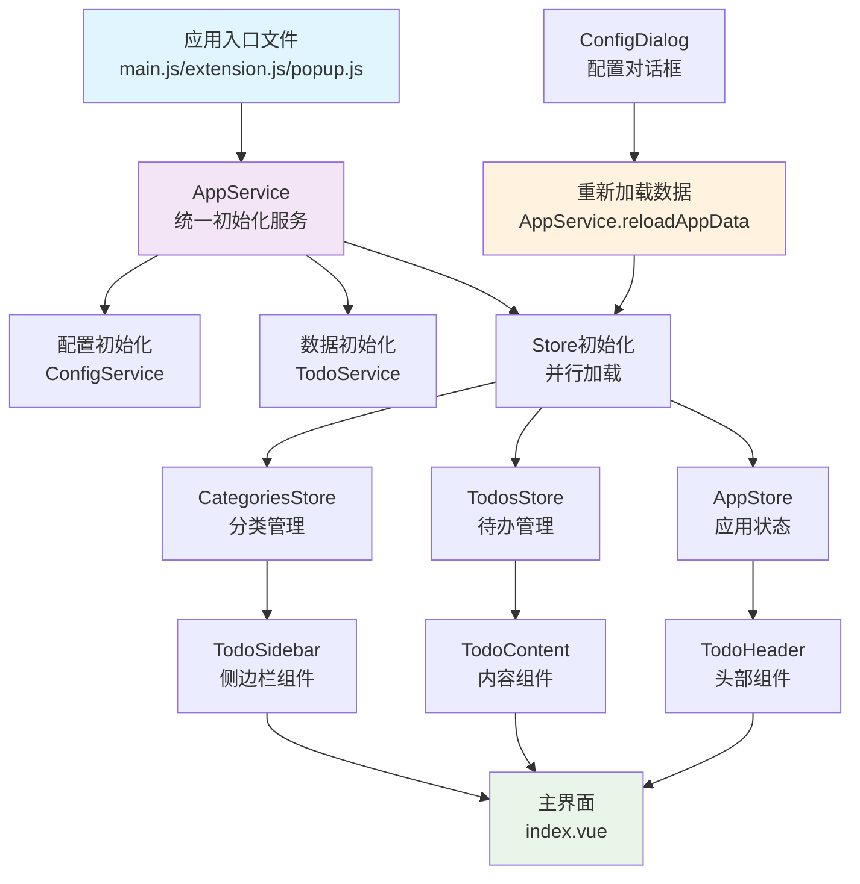

# TidyDo

> 一个现代化的待办事项管理应用，支持分类管理、筛选、标签、归档等功能。

## 🚀 项目概述

TidyDo 是一个基于 Vue 3 + Vuetify 构建的待办事项管理应用，具有简洁优雅的界面和强大的功能。支持 Web 应用、Chrome 扩展等多种部署方式。

### ✨ 核心特性

- **📂 分类管理** - 支持创建、编辑、删除分类，拖拽排序
- **🔍 智能筛选** - 支持按状态、日期、分类、标签等多维度筛选
- **🏷️ 标签系统** - 为待办事项添加标签，便于分类和检索
- **📅 截止日期** - 设置截止日期，支持日期排序
- **📊 状态管理** - 待办/完成/取消等状态切换
- **🗂️ 归档功能** - 支持归档已完成的待办事项
- **🔄 数据同步** - 基于 IndexedDB 的本地数据持久化
- **📱 响应式设计** - 完美适配桌面和移动设备
- **🎨 现代化UI** - 基于 Material Design 设计语言

### 🛠️ 技术栈

- **前端框架**: Vue 3 (Composition API)
- **UI 组件库**: Vuetify 3
- **状态管理**: Pinia
- **路由**: Vue Router
- **样式**: Tailwind CSS + Vuetify
- **图标**: Material Design Icons
- **数据存储**: IndexedDB (idb-keyval)
- **构建工具**: Vite
- **开发语言**: JavaScript

## 🏗️ 系统架构

### 初始化流程时序图



### 架构特点

- **统一初始化**: 通过 `AppService` 统一管理应用启动流程
- **并行加载**: 分类和待办数据并行加载，提高性能
- **状态同步**: 基于 Pinia 的响应式状态管理
- **组件解耦**: 清晰的组件职责划分，便于维护和扩展

## 📁 项目结构

```
TidyDo/
├── src/
│   ├── assets/              # 静态资源
│   │   ├── icons/          # 图标文件
│   │   └── tailwind.css    # 样式文件
│   ├── components/         # 公共组件
│   │   └── TodoSidebar.vue # 侧边栏组件
│   ├── composables/        # 组合式函数
│   │   ├── useDialog.js    # 弹窗管理
│   │   └── useNotification.js # 通知管理
│   ├── model/              # 弹窗组件
│   │   ├── CategoryEditDialog.vue # 分类编辑
│   │   ├── ConfigDialog.vue       # 配置对话框
│   │   └── TodoEditDialog.vue     # 待办编辑
│   ├── router/             # 路由配置
│   │   └── index.js
│   ├── services/           # 服务层
│   │   ├── appService.js   # 应用服务
│   │   ├── configService.js # 配置服务
│   │   ├── dataService.js  # 数据服务
│   │   └── todoService.js  # 待办服务
│   ├── stores/             # 状态管理
│   │   ├── useAppStore.js        # 应用状态
│   │   ├── useCategoriesStore.js # 分类管理
│   │   └── useTodosStore.js      # 待办管理
│   ├── views/              # 页面组件
│   │   └── tidyDo/
│   │       ├── components/
│   │       │   ├── TableRow.vue     # 表格行
│   │       │   ├── TodoContent.vue  # 内容区域
│   │       │   ├── TodoHeader.vue   # 头部工具栏
│   │       │   └── TodoItem.vue     # 待办项
│   │       └── index.vue            # 主页面
│   ├── App.vue             # 根组件
│   ├── main.js             # Web 应用入口
│   ├── extension.js        # Chrome 扩展入口
│   └── popup.js            # 弹窗页面入口
├── public/                 # 静态文件
├── scripts/                # 构建脚本
├── manifest.json           # Chrome 扩展配置
└── package.json           # 项目配置
```

## 🧩 核心组件介绍

### 🎛️ 服务层 (Services)

#### AppService
- **职责**: 统一管理应用初始化流程
- **功能**: 
  - 防重复初始化
  - 并发保护
  - 错误处理
  - 数据重载
- **关键方法**:
  - `initializeApp()`: 应用初始化
  - `reloadAppData()`: 重新加载数据
  - `resetAppState()`: 重置应用状态

#### TodoService
- **职责**: 待办事项和分类的数据操作
- **功能**:
  - 数据 CRUD 操作
  - 数据结构定义
  - 默认数据初始化
- **关键类**:
  - `CategoryService`: 分类管理
  - `TodoItemService`: 待办项管理

#### ConfigService
- **职责**: 应用配置管理
- **功能**: 配置的读取、保存和合并

#### DataService
- **职责**: 数据导入导出
- **功能**: 数据备份、恢复和迁移

### 📊 状态管理 (Stores)

#### AppStore
- **职责**: 应用全局状态管理
- **状态**: 选中分类、查看模式、排序、搜索
- **计算属性**: 当前待办、表格列配置
- **关键方法**:
  - `selectCategory()`: 选择分类
  - `toggleSort()`: 切换排序
  - `initializeSelection()`: 初始化选择状态

#### CategoriesStore
- **职责**: 分类数据管理
- **状态**: 分类列表、加载状态
- **功能**: 分类的增删改查、排序
- **关键方法**:
  - `loadCategories()`: 加载分类
  - `createNewCategory()`: 创建分类
  - `updateCategory()`: 更新分类

#### TodosStore
- **职责**: 待办事项数据管理
- **状态**: 待办列表、归档状态
- **功能**: 待办的增删改查、状态切换
- **关键方法**:
  - `loadTodos()`: 加载待办
  - `createTodo()`: 创建待办
  - `updateTodo()`: 更新待办

### 🎨 UI 组件

#### TodoSidebar
- **职责**: 侧边栏导航
- **功能**: 分类列表、分类操作、设置入口
- **特性**: 可折叠、拖拽排序

#### TodoHeader
- **职责**: 头部工具栏
- **功能**: 搜索、创建待办、视图切换
- **特性**: 响应式布局、状态提示

#### TodoContent
- **职责**: 待办列表内容区
- **功能**: 待办列表展示、排序、筛选
- **特性**: 空状态处理、搜索高亮

#### TodoItem
- **职责**: 单个待办项展示
- **功能**: 待办信息显示、操作按钮
- **特性**: 状态切换、快速操作

### 🔧 辅助工具

#### Composables
- **useDialog**: 弹窗状态管理
- **useNotification**: 通知消息管理

#### 弹窗组件
- **TodoEditDialog**: 待办编辑弹窗
- **CategoryEditDialog**: 分类编辑弹窗
- **ConfigDialog**: 配置管理弹窗

## 🚀 开发指南

### 环境要求

- Node.js >= 16.0.0
- npm >= 7.0.0

### 快速开始

```bash
# 克隆项目
git clone [repository-url]

# 安装依赖
npm install

# 启动开发服务器
npm run dev

# 构建生产版本
npm run build
```

### 开发流程

1. **新增功能**:
   - 在对应的 Store 中添加状态和方法
   - 创建或修改相关组件
   - 更新路由配置（如需要）

2. **数据结构修改**:
   - 更新 `todoService.js` 中的数据结构
   - 修改相关的 Store 和组件
   - 考虑数据迁移

3. **UI 组件开发**:
   - 使用 Vuetify 组件库
   - 遵循 Material Design 设计规范
   - 确保响应式设计

### 代码规范

- 使用 Vue 3 Composition API
- 遵循 ESLint 配置
- 组件命名使用 PascalCase
- 文件命名使用 camelCase
- 方法命名使用动词开头

### 调试指南

- 使用 Vue DevTools 调试组件状态
- 在浏览器中查看 IndexedDB 数据
- 利用 console.log 输出调试信息
- 检查网络请求和错误日志

## 📱 部署方式

### Web 应用
```bash
npm run build
# 将 dist 目录部署到 Web 服务器
```

### Chrome 扩展
```bash
npm run build:extension
# 在 Chrome 中加载 dist 目录作为扩展
```

### 本地应用
```bash
npm run dev
# 直接在浏览器中打开 localhost:5173
```

## 🤝 贡献指南

1. Fork 项目
2. 创建功能分支 (`git checkout -b feature/AmazingFeature`)
3. 提交更改 (`git commit -m 'Add some AmazingFeature'`)
4. 推送到分支 (`git push origin feature/AmazingFeature`)
5. 创建 Pull Request

## 📄 许可证

本项目采用 MIT 许可证 - 查看 [LICENSE](LICENSE) 文件了解详情。

## 🔗 相关链接

- [Vue 3 文档](https://vuejs.org/)
- [Vuetify 3 文档](https://vuetifyjs.com/)
- [Pinia 文档](https://pinia.vuejs.org/)
- [Vite 文档](https://vitejs.dev/)

---

## 🚧 开发状态

### 已完成功能
- ✅ 基础待办管理
- ✅ 分类系统
- ✅ 筛选功能
- ✅ 标签系统
- ✅ 归档功能
- ✅ 数据导入导出
- ✅ 响应式设计

### 规划中功能
- 🔄 主题切换
- 🔄 多语言支持
- 🔄 数据同步
- 🔄 提醒功能

---

*如有问题或建议，请提交 Issue 或 Pull Request。*
