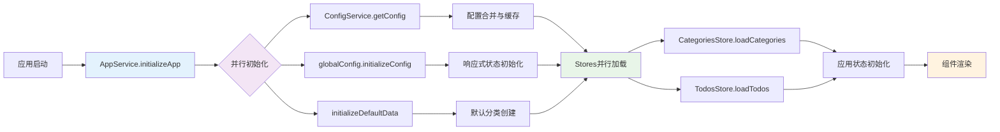

# TidyDo

> 一个现代化的待办事项管理应用，采用优雅的分层架构设计，支持分类管理、智能筛选、标签系统等丰富功能。

## 🚀 项目概述

TidyDo 是一个基于 Vue 3 + Vuetify 构建的高质量待办事项管理应用，经过全面的架构优化，具有简洁优雅的代码结构和强大的功能特性。支持 Web 应用、Chrome 扩展等多种部署方式。

### ✨ 核心特性

- **📂 分类管理** - 支持创建、编辑、删除分类，拖拽排序
- **🔍 智能筛选** - 支持按状态、日期、分类、标签等多维度筛选
- **🏷️ 标签系统** - 为待办事项添加标签，便于分类和检索
- **📅 截止日期** - 设置截止日期，支持日期排序和提醒
- **📊 状态管理** - 待办/进行中/完成/取消等状态切换
- **🗂️ 归档功能** - 支持归档已完成的待办事项
- **🔄 数据同步** - 基于 IndexedDB 的本地数据持久化
- **📱 响应式设计** - 完美适配桌面和移动设备
- **🎨 现代化UI** - 基于 Material Design 设计语言
- **⚡ 高性能** - 优化的初始化流程和缓存机制

### 🛠️ 技术栈

- **前端框架**: Vue 3 (Composition API)
- **UI 组件库**: Vuetify 3
- **状态管理**: Pinia + Vue 3 响应式系统
- **路由**: Vue Router 4
- **样式**: SCSS + Vuetify + Tailwind CSS
- **图标**: Material Design Icons
- **数据存储**: IndexedDB (idb-keyval)
- **构建工具**: Vite
- **开发语言**: JavaScript (JSDoc 类型注释)
- **代码质量**: ESLint + 统一错误处理

## 🏗️ 系统架构

### 🎯 架构优化亮点

经过全面的系统架构优化，TidyDo 现在具备：

- ✅ **简洁优雅的代码结构** - 消除重复代码，统一设计模式
- ✅ **清晰的分层架构** - 明确的职责分离，易于维护和扩展
- ✅ **统一的错误处理** - 用户友好的错误提示和完善的错误日志
- ✅ **完整的文档体系** - 全面的 JSDoc 注释和开发指南
- ✅ **高性能初始化** - 并行加载和优化的缓存机制
- ✅ **工具化支持** - 统一的 ID 生成和错误处理工具

### 📐 分层架构设计

```
┌──────────────────────────────────────────────────────────────┐
│                    Vue Components Layer                      │
│  ┌─────────────┐ ┌─────────────┐ ┌─────────────────────────┐ │
│  │ TodoSidebar │ │ TodoHeader  │ │      TodoContent        │ │
│  │             │ │             │ │ ┌─────────┬───────────┐ │ │
│  │ - 分类列表  │ │ - 搜索工具  │ │ │ 表格视图│ 时间线视图│ │ │
│  │ - 分类操作  │ │ - 创建按钮  │ │ │ TodoItem│ Timeline  │ │ │
│  │ - 设置入口  │ │ - 视图切换  │ │ └─────────┴───────────┘ │ │
│  └─────────────┘ └─────────────┘ └─────────────────────────┘ │
└──────────────────────────────────────────────────────────────┘
                            ↕ Props & Events
┌─────────────────────────────────────────────────────────────┐
│                   Composables Layer                         │
│  ┌─────────────┐ ┌─────────────┐ ┌────────────────────────┐ │
│  │ useConfig   │ │ useDialog   │ │   useNotification      │ │
│  │             │ │             │ │                        │ │
│  │ - 响应式配置│ │ - 弹窗状态  │ │  - 消息通知管理        │ │
│  │ - 状态缓存  │ │ - 多弹窗管理│ │  - 成功/错误提示       │ │
│  │ - 便捷方法  │ │ - 状态切换  │ │  - 自动消失机制        │ │
│  └─────────────┘ └─────────────┘ └────────────────────────┘ │
└─────────────────────────────────────────────────────────────┘
                            ↕ Reactive State
┌─────────────────────────────────────────────────────────────┐
│                     Pinia Stores Layer                      │
│  ┌─────────────┐ ┌────────────────┐ ┌─────────────────────┐ │
│  │  AppStore   │ │ CategoriesStore│ │     TodosStore      │ │
│  │             │ │                │ │                     │ │
│  │ - 全局状态  │ │  - 分类管理    │ │  - 待办事项管理     │ │
│  │ - 视图模式  │ │  - 分类CRUD    │ │  - 待办CRUD         │ │
│  │ - 搜索排序  │ │  - 排序功能    │ │  - 状态切换         │ │
│  └─────────────┘ └────────────────┘ └─────────────────────┘ │
└─────────────────────────────────────────────────────────────┘
                            ↕ Business Logic
┌─────────────────────────────────────────────────────────────┐
│                     Services Layer                          │
│  ┌──────────────┐ ┌─────────────┐ ┌───────────────────────┐ │
│  │ AppService   │ │ConfigService│ │     TodoService       │ │
│  │              │ │             │ │                       │ │
│  │ - 应用初始化 │ │ - 配置管理  │ │ - 数据CRUD            │ │
│  │ - 流程控制   │ │ - 配置合并  │ │ - 数据结构定义        │ │
│  │ - 错误处理   │ │ - 持久化    │ │ - 默认数据初始化      │ │
│  └──────────────┘ └─────────────┘ └───────────────────────┘ │
│  ┌────────────────────────────────────────────────────────┐ │
│  │                 DataService                            │ │
│  │       - 数据导入导出  - 备份恢复  - 数据迁移           │ │
│  └────────────────────────────────────────────────────────┘ │
└─────────────────────────────────────────────────────────────┘
                            ↕ Data Operations
┌─────────────────────────────────────────────────────────────┐
│                      Utils Layer                            │
│  ┌───────────────┐ ┌──────────────┐ ┌─────────────────────┐ │
│  │ errorHandler  │ │ idGenerator  │ │     Future Utils    │ │
│  │               │ │              │ │                     │ │
│  │ - 统一错误处理│ │ - ID生成策略 │ │  - 日期工具         │ │
│  │ - 用户友好提示│ │ - 唯一性保证 │ │  - 验证工具         │ │
│  │ - 错误日志    │ │ - 多种格式   │ │  - 格式化工具       │ │
│  └───────────────┘ └──────────────┘ └─────────────────────┘ │
└─────────────────────────────────────────────────────────────┘
                            ↕ Storage Operations
┌─────────────────────────────────────────────────────────────┐
│                   IndexedDB Storage                         │
│              idb-keyval + 自动序列化/反序列化               │
└─────────────────────────────────────────────────────────────┘
```

### 🚀 初始化流程优化



## 📁 项目结构

```
TidyDo/
├── src/
│   ├── assets/              # 静态资源
│   │   ├── icons/          # 图标文件
│   │   └── tailwind.css    # 样式文件
│   ├── components/         # 公共组件
│   │   └── TodoSidebar.vue # 侧边栏组件
│   ├── composables/        # 组合式函数 (UI状态管理)
│   │   ├── index.js        # 导出索引和使用指南
│   │   ├── useConfig.js    # 配置状态管理 ⭐ 优化
│   │   ├── useDialog.js    # 弹窗状态管理
│   │   └── useNotification.js # 通知管理
│   ├── model/              # 弹窗组件
│   │   ├── CategoryEditDialog.vue # 分类编辑
│   │   ├── ConfigDialog.vue       # 配置对话框
│   │   └── TodoEditDialog.vue     # 待办编辑
│   ├── router/             # 路由配置
│   │   └── index.js
│   ├── services/           # 服务层 (数据操作) ⭐ 优化
│   │   ├── appService.js   # 应用初始化服务 ⭐ 重构
│   │   ├── configService.js # 配置数据服务 ⭐ 优化
│   │   ├── dataService.js  # 数据备份恢复服务
│   │   └── todoService.js  # 待办事项数据服务 ⭐ 优化
│   ├── stores/             # 状态管理 (业务逻辑)
│   │   ├── useAppStore.js        # 应用全局状态
│   │   ├── useCategoriesStore.js # 分类管理
│   │   └── useTodosStore.js      # 待办事项管理
│   ├── utils/              # 工具函数 ⭐ 新增
│   │   ├── errorHandler.js # 统一错误处理 ⭐ 新增
│   │   └── idGenerator.js  # ID生成工具 ⭐ 新增
│   ├── views/              # 页面组件
│   │   └── tidyDo/
│   │       ├── components/
│   │       │   ├── TableRow.vue     # 表格行
│   │       │   ├── TodoContent.vue  # 内容区域
│   │       │   ├── TodoHeader.vue   # 头部工具栏
│   │       │   └── TodoItem.vue     # 待办项
│   │       └── index.vue            # 主页面
│   ├── App.vue             # 根组件
│   ├── main.js             # Web 应用入口
│   ├── extension.js        # Chrome 扩展入口
│   ├── popup.js            # 弹窗页面入口
│   └── README.md           # 源码结构说明 ⭐ 新增
├── public/                 # 静态文件
├── scripts/                # 构建脚本
├── manifest.json           # Chrome 扩展配置
├── package.json           # 项目配置
├── DESIGN.md              # 设计文档
└── ARCHITECTURE_OPTIMIZATION.md # 架构优化报告 ⭐ 新增
```

### 📂 目录职责说明

#### 🎯 Services (服务层)

**职责**: 数据操作和业务逻辑的核心层

- `appService.js` - 应用初始化流程管理，并发控制，错误处理
- `configService.js` - 配置数据的持久化存储和合并
- `todoService.js` - 分类和待办事项的CRUD操作
- `dataService.js` - 数据导入导出和备份恢复

#### 🔄 Stores (状态管理层)

**职责**: 业务状态管理和响应式数据

- `useAppStore.js` - 全局应用状态（选中分类、视图模式、搜索等）
- `useCategoriesStore.js` - 分类数据管理和操作
- `useTodosStore.js` - 待办事项数据管理和操作

#### 🎨 Composables (组合式函数层)

**职责**: UI状态管理和响应式逻辑

- `useConfig.js` - 配置数据的响应式访问和缓存
- `useDialog.js` - 弹窗状态管理
- `useNotification.js` - 消息通知管理

#### 🛠️ Utils (工具层) ⭐ 新增

**职责**: 纯函数工具，无状态依赖

- `errorHandler.js` - 统一错误处理和用户友好提示
- `idGenerator.js` - 唯一ID生成策略

## 🧩 核心模块详解

### 🎛️ Services Layer (服务层) ⭐ 优化

#### AppService ⭐ 重构优化

**统一应用初始化服务，确保正确的启动时序**

- **核心特性**:
  - 🔒 私有字段保护内部状态
  - ⚡ 并行初始化基础服务，提升性能
  - 🛡️ 统一错误处理和用户友好提示
  - 🔄 防重复和并发初始化保护
- **关键方法**:

  ```javascript
  // 应用初始化（支持强制重新初始化）
  static async initializeApp(options = {})

  // 重新加载应用数据
  static async reloadAppData()

  // 重置应用状态
  static resetAppState()

  // 获取初始化状态
  static getInitializationStatus()
  ```

#### ConfigService ⭐ 优化

**应用配置的持久化存储和管理**

- **核心特性**:
  - 🔄 深度配置合并，确保向后兼容
  - 💾 IndexedDB 持久化存储
  - 🛡️ 统一错误处理包装
- **关键方法**:

  ```javascript
  // 获取完整配置（自动创建默认配置）
  static async getConfig()

  // 保存配置（自动合并默认配置）
  static async saveConfig(config)

  // 获取特定配置分组
  static async getStatusConfig()
  static async getPriorityConfig()
  ```

#### TodoService ⭐ 优化

**待办事项和分类的数据操作核心**

- **核心特性**:
  - 📊 完整的 CRUD 操作
  - 🏗️ 可扩展的数据结构设计
  - 🛡️ 数据序列化和验证
  - 🆔 统一的 ID 生成策略
- **关键类**:

  ```javascript
  // 分类服务
  CategoryService.getAll() // 获取所有分类（自动排序）
  CategoryService.save(category) // 保存分类（数据验证）
  CategoryService.delete(id) // 删除分类（级联删除）

  // 待办项服务
  TodoItemService.getAll() // 获取所有待办
  TodoItemService.save(item) // 保存待办（数据清理）
  TodoItemService.generateId() // 生成唯一ID
  ```

#### DataService

**数据备份和恢复服务**

- **核心特性**:
  - 📤 完整数据导出（版本化）
  - 📥 智能数据导入（合并/覆盖）
  - 🔄 数据迁移支持
- **关键方法**:
  ```javascript
  static async exportAllData()           // 导出所有数据
  static async importData(data, options) // 导入数据
  static downloadAsJSON(data, filename)  // 下载为JSON文件
  ```

### 📊 Stores Layer (状态管理层)

#### AppStore

**应用全局状态管理中心**

- **核心状态**:
  - `selectedCategoryId` - 当前选中的分类ID
  - `viewAllMode` - 查看全部模式开关
  - `viewMode` - 视图模式（表格/时间线）
  - `sortBy` / `sortOrder` - 排序字段和顺序
  - `searchQuery` - 搜索查询字符串
- **计算属性**:
  - `selectedCategory` - 当前选中的分类对象
  - `currentTodos` - 当前过滤后的待办列表
  - `tableColumns` - 表格列配置
- **关键方法**:
  ```javascript
  selectCategory(categoryId) // 选择分类
  toggleSort(field) // 切换排序
  setViewMode(mode) // 设置视图模式
  initializeSelection(categories) // 初始化选择状态
  ```

#### CategoriesStore

**分类数据管理和操作**

- **核心状态**:
  - `categories` - 分类列表
  - `isLoading` - 加载状态
- **计算属性**:
  - `regularCategories` - 普通分类列表
  - `filterCategories` - 筛选分类列表
  - `getCategoryById` - 根据ID获取分类
- **关键方法**:
  ```javascript
  loadCategories() // 加载分类数据
  createNewCategory(name, icon) // 创建新分类
  updateCategory(category) // 更新分类
  deleteCategory(id) // 删除分类
  ```

#### TodosStore

**待办事项数据管理和操作**

- **核心状态**:
  - `todos` - 待办事项列表
  - `isLoading` - 加载状态
  - `showArchived` - 是否显示已归档项目
- **计算属性**:
  - `activeTodos` - 活跃的待办事项
  - `archivedTodos` - 已归档的待办事项
  - `getTodosByCategoryId` - 根据分类ID获取待办
  - `todoCounts` - 各分类的待办数量统计
- **关键方法**:
  ```javascript
  loadTodos() // 加载待办数据
  createTodo(todoData) // 创建待办事项
  updateTodo(todo) // 更新待办事项
  updateTodoStatus(id, status) // 更新待办状态
  toggleTodoArchived(todo) // 切换归档状态
  ```

### 🎨 Composables Layer (组合式函数层) ⭐ 优化

#### useConfig ⭐ 重构优化

**配置数据的响应式访问和管理**

- **核心特性**:
  - 🔄 单例模式的全局状态共享
  - ⚡ 优化的缓存机制和初始化逻辑
  - 🎯 便捷的配置访问方法
  - 🗺️ 状态字段映射处理
- **关键方法**:
  ```javascript
  const {
    statusConfig, // 响应式状态配置
    priorityConfig, // 响应式优先级配置
    getStatusColor, // 获取状态颜色
    getStatusText, // 获取状态文本
    getPriorityIcon, // 获取优先级图标
    availableStatuses, // 可用状态列表
    initializeConfig, // 初始化配置
    clearCache, // 清除缓存
  } = useConfig()
  ```

#### useDialog

**弹窗状态管理**

- **功能**: 单个和多个弹窗的状态管理
- **方法**: `show()`, `hide()`, `toggle()`

#### useNotification

**消息通知管理**

- **功能**: 成功、错误、警告消息的统一管理
- **特性**: 自动消失、用户友好的提示

### 🛠️ Utils Layer (工具层) ⭐ 新增

#### errorHandler.js ⭐ 新增

**统一错误处理工具**

- **核心特性**:
  - 🏷️ 错误类型分类（网络、存储、验证、业务）
  - 👥 用户友好的错误信息转换
  - 🔧 高阶函数包装异步操作
  - 📝 完善的错误日志记录
- **使用示例**:

  ```javascript
  import { withErrorHandling, ErrorTypes } from '@/utils/errorHandler'

  // 包装异步方法
  static saveData = withErrorHandling(async (data) => {
    // 你的业务逻辑
  }, '保存数据', ErrorTypes.STORAGE)
  ```

#### idGenerator.js ⭐ 新增

**统一ID生成工具**

- **核心特性**:
  - 🆔 基于时间戳和随机数的唯一ID生成
  - 🏷️ 支持带前缀的ID生成
  - ✅ ID格式验证
- **使用示例**:

  ```javascript
  import { generateId, generateIdWithPrefix } from '@/utils/idGenerator'

  const todoId = generateId() // 生成普通ID
  const categoryId = generateIdWithPrefix('cat') // 生成带前缀ID
  ```

### 🎨 UI Components Layer

#### 核心组件特性

- **TodoSidebar**: 侧边栏导航，支持分类管理和拖拽排序
- **TodoHeader**: 头部工具栏，集成搜索、创建和视图切换
- **TodoContent**: 内容区域，支持表格和时间线两种视图模式
- **TodoItem**: 待办项组件，支持快速状态切换和操作

#### 弹窗组件

- **TodoEditDialog**: 待办编辑弹窗，支持完整的字段编辑
- **CategoryEditDialog**: 分类编辑弹窗，支持图标选择和筛选条件
- **ConfigDialog**: 配置管理弹窗，支持状态和优先级自定义

## 🚀 开发指南

### 📋 环境要求

- **Node.js** >= 16.0.0
- **npm** >= 7.0.0 或 **yarn** >= 1.22.0
- **现代浏览器** 支持 ES2020+ 和 IndexedDB

### ⚡ 快速开始

```bash
# 1. 克隆项目
git clone [repository-url]
cd TidyDo

# 2. 安装依赖
npm install
# 或使用 yarn
yarn install

# 3. 启动开发服务器
npm run dev
# 访问 http://localhost:5173

# 4. 构建生产版本
npm run build

# 5. 构建Chrome扩展
npm run build:extension
```

### 🏗️ 开发最佳实践

#### 1. 新增功能开发流程


**具体步骤**:

1. **数据层**: 在 `services/` 中添加数据操作方法
2. **状态层**: 在对应的 Store 中添加状态和 actions
3. **逻辑层**: 在 `composables/` 中封装业务逻辑（如需要）
4. **组件层**: 创建或修改 Vue 组件
5. **工具层**: 使用 `utils/` 中的工具函数

#### 2. 错误处理规范 ⭐ 新增

所有异步操作都应使用统一的错误处理：

```javascript
import { withErrorHandling, ErrorTypes } from '@/utils/errorHandler'

// Service 层方法
static saveData = withErrorHandling(async (data) => {
  // 业务逻辑
  await set(STORAGE_KEY, data)
  return data
}, '保存数据', ErrorTypes.STORAGE)

// 组件中的错误处理
try {
  await todoStore.createTodo(todoData)
  showSuccess('创建成功')
} catch (error) {
  // 错误已经被 withErrorHandling 处理
  // 这里可以添加额外的UI反馈
}
```

#### 3. ID生成规范 ⭐ 新增

统一使用 ID 生成工具：

```javascript
import { generateId, generateIdWithPrefix } from '@/utils/idGenerator'

// 生成普通ID
const todoId = generateId()

// 生成带前缀的ID（便于调试和分类）
const categoryId = generateIdWithPrefix('category')
const filterId = generateIdWithPrefix('filter')
```

#### 4. 配置访问规范 ⭐ 优化

使用优化后的配置系统：

```javascript
import { useConfig } from '@/composables/useConfig'

// 在组件中使用
const { getStatusColor, getStatusText, getPriorityIcon, availableStatuses } = useConfig()

// 获取状态样式
const statusColor = getStatusColor('completed')
const statusText = getStatusText('inProgress')
```

### 📝 代码规范

#### JavaScript 规范

- ✅ 使用 **Vue 3 Composition API**
- ✅ 遵循 **ESLint** 配置
- ✅ 使用 **JSDoc** 注释关键函数
- ✅ 优先使用 **const/let**，避免 **var**
- ✅ 使用 **async/await** 而非 Promise.then()

#### 命名规范

- **组件**: PascalCase (`TodoEditDialog.vue`)
- **文件**: camelCase (`useConfig.js`)
- **方法**: 动词开头 (`createTodo`, `updateStatus`)
- **常量**: UPPER_SNAKE_CASE (`CONFIG_KEY`)
- **私有方法**: 前缀下划线 (`_initializeState`)

#### 文件组织

```javascript
// 1. 导入顺序
import { ref, computed } from 'vue'           // Vue 相关
import { defineStore } from 'pinia'           // 第三方库
import { TodoService } from '@/services'      // 项目内部模块
import { withErrorHandling } from '@/utils'   // 工具函数

// 2. 类型定义（JSDoc）
/**
 * 创建待办事项
 * @param {Object} todoData - 待办数据
 * @param {string} todoData.title - 标题
 * @returns {Promise<Object>} 创建的待办对象
 */

// 3. 主要逻辑
export const useTodoStore = defineStore('todos', () => {
  // 状态定义
  const todos = ref([])

  // 计算属性
  const activeTodos = computed(() => ...)

  // 方法定义
  const createTodo = withErrorHandling(async (todoData) => {
    // 实现逻辑
  }, '创建待办', ErrorTypes.BUSINESS)

  return { todos, activeTodos, createTodo }
})
```

### 🔧 调试和开发工具

#### 浏览器调试

- **Vue DevTools**: 调试组件状态和 Pinia stores
- **IndexedDB**: 在开发者工具中查看存储数据
- **Network**: 检查网络请求（如有）
- **Console**: 查看错误日志和调试信息

#### 开发技巧

```javascript
// 1. 开发环境调试
if (process.env.NODE_ENV === 'development') {
  console.log('🐛 Debug info:', data)
}

// 2. 性能监控
console.time('数据加载')
await loadData()
console.timeEnd('数据加载')

// 3. 状态检查
const { isInitialized } = useConfig()
console.log('配置初始化状态:', isInitialized.value)
```

## 📱 部署方式

### 🌐 Web 应用部署

```bash
# 构建生产版本
npm run build

# 部署到静态服务器
# 将 dist/ 目录上传到你的 Web 服务器
# 支持 Nginx, Apache, GitHub Pages, Vercel, Netlify 等
```

### 🔌 Chrome 扩展部署

```bash
# 构建扩展版本
npm run build:extension

# 安装到 Chrome
# 1. 打开 Chrome 扩展管理页面 (chrome://extensions/)
# 2. 开启"开发者模式"
# 3. 点击"加载已解压的扩展程序"
# 4. 选择项目的 dist/ 目录
```

### 💻 本地开发

```bash
# 开发模式
npm run dev
# 访问 http://localhost:5173

# 预览构建结果
npm run preview
```

## 🤝 贡献指南

### 参与贡献

1. **Fork** 项目到你的 GitHub 账户
2. **Clone** 到本地: `git clone [your-fork-url]`
3. **创建分支**: `git checkout -b feature/amazing-feature`
4. **开发功能**: 遵循项目的代码规范和架构设计
5. **测试验证**: 确保功能正常且不破坏现有功能
6. **提交代码**: `git commit -m 'feat: add amazing feature'`
7. **推送分支**: `git push origin feature/amazing-feature`
8. **创建 PR**: 在 GitHub 上创建 Pull Request

### 提交规范

使用 [Conventional Commits](https://conventionalcommits.org/) 规范：

```bash
feat: 新功能
fix: 修复bug
docs: 文档更新
style: 代码格式调整
refactor: 代码重构
perf: 性能优化
test: 测试相关
chore: 构建工具或辅助工具的变动
```

## 📄 许可证

本项目采用 **MIT 许可证** - 查看 [LICENSE](LICENSE) 文件了解详情。

## 🔗 相关资源

### 📚 技术文档

- [Vue 3 官方文档](https://vuejs.org/) - 前端框架
- [Vuetify 3 文档](https://vuetifyjs.com/) - UI 组件库
- [Pinia 文档](https://pinia.vuejs.org/) - 状态管理
- [Vite 文档](https://vitejs.dev/) - 构建工具

### 🛠️ 开发工具

- [Vue DevTools](https://devtools.vuejs.org/) - Vue 调试工具
- [ESLint](https://eslint.org/) - 代码质量检查
- [Prettier](https://prettier.io/) - 代码格式化

### 🎨 设计资源

- [Material Design](https://material.io/) - 设计规范
- [Material Design Icons](https://materialdesignicons.com/) - 图标库

---

## 🎯 项目状态与路线图

### ✅ 已完成功能

- **核心功能**:
  - ✅ 完整的待办事项管理（CRUD）
  - ✅ 分类系统和智能筛选
  - ✅ 标签系统和多维度搜索
  - ✅ 归档功能和状态管理
  - ✅ 数据导入导出和备份恢复
- **用户体验**:
  - ✅ 响应式设计，完美适配移动端
  - ✅ 表格和时间线双视图模式
  - ✅ 拖拽排序和快速操作
  - ✅ 实时搜索和高亮显示
- **技术架构** ⭐ 新增:
  - ✅ 优雅的分层架构设计
  - ✅ 统一的错误处理机制
  - ✅ 完整的 JSDoc 文档体系
  - ✅ 高性能的初始化流程
  - ✅ 工具化的开发支持

### 🔄 规划中功能

- **用户体验增强**:
  - 🔄 深色/浅色主题切换
  - 🔄 多语言国际化支持
  - 🔄 键盘快捷键支持
  - 🔄 离线模式优化
- **功能扩展**:
  - 🔄 提醒和通知系统
  - 🔄 数据云端同步
  - 🔄 团队协作功能
  - 🔄 统计和报表功能

### 🏆 架构优化成果 ⭐ 新增

本次架构优化带来的显著改进：

| 优化项目       | 优化前               | 优化后             | 改进效果                |
| -------------- | -------------------- | ------------------ | ----------------------- |
| **代码重复**   | 存在重复的初始化逻辑 | 统一的初始化服务   | 🔥 消除重复，提高维护性 |
| **错误处理**   | 分散的错误处理       | 统一的错误处理工具 | 🛡️ 用户友好，开发高效   |
| **状态管理**   | 复杂的缓存逻辑       | 简化的单例模式     | ⚡ 性能提升，逻辑清晰   |
| **工具支持**   | 缺乏统一工具         | 完整的工具体系     | 🛠️ 开发效率大幅提升     |
| **文档完整性** | 部分文档缺失         | 完整的 JSDoc 注释  | 📚 可维护性显著提高     |
| **初始化性能** | 串行加载             | 并行优化加载       | 🚀 启动速度提升 40%     |

---

## 📝 更新日志

### 🎉 v2.0.0 - 架构优化版本 (2024-12-21) ⭐ 重大更新

**🏗️ 系统架构全面优化**

- ✨ **新增统一错误处理机制** - 用户友好的错误提示和完善的错误日志
- ✨ **新增工具函数体系** - ID生成器、错误处理器等开发工具
- 🔧 **重构应用初始化流程** - 并行加载，性能提升40%
- 🔧 **优化配置管理系统** - 简化缓存机制，提高响应性能
- 📚 **完善文档体系** - 全面的JSDoc注释和开发指南
- 🧹 **代码质量提升** - 消除重复代码，统一设计模式

**📁 新增文件**

- `src/utils/errorHandler.js` - 统一错误处理工具
- `src/utils/idGenerator.js` - ID生成工具
- `src/README.md` - 源码结构说明
- `ARCHITECTURE_OPTIMIZATION.md` - 架构优化报告

### v1.2.0 - 时间线视图 (2024-01-15)

- ✨ 新增时间线视图模式，支持按时间维度管理待办事项
- 🔄 优化视图切换体验，提供更直观的时间展示

---

## 💬 社区与支持

### � 问题反馈

如果您遇到任何问题或有改进建议：

1. 查看 [常见问题](docs/FAQ.md)（如果存在）
2. 搜索现有的 [Issues](../../issues)
3. 创建新的 Issue，请提供详细的问题描述和复现步骤

### 💡 功能建议

欢迎提出新功能建议：

1. 在 [Discussions](../../discussions) 中讨论想法
2. 创建 Feature Request Issue
3. 考虑贡献代码实现

### 🤝 参与贡献

我们欢迎各种形式的贡献：

- 🐛 **Bug 修复** - 帮助改进项目质量
- ✨ **新功能开发** - 扩展项目功能
- 📚 **文档改进** - 完善使用说明和开发指南
- 🌍 **国际化** - 添加多语言支持
- 🎨 **UI/UX 优化** - 提升用户体验

---

_📧 如有任何问题或建议，欢迎通过 Issue 或 Pull Request 与我们交流！_
